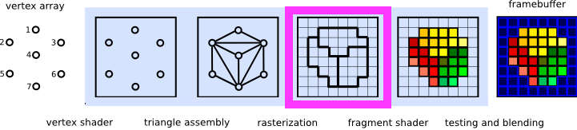
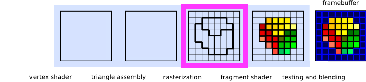
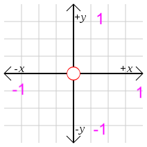

name: inverse
layout: true
class: center, middle, inverse
---

# Shader Programming Workshop

#### Prof. Dr. Lena Gieseke | l.gieseke@filmuniversitaet.de  
#### Film University Babelsberg KONRAD WOLF

## *Overview 2*


<!--
Start server in /doc/

h or ?: Toggle the help window
j: Jump to next slide
k: Jump to previous slide
b: Toggle blackout mode
m: Toggle mirrored mode.
c: Create a clone presentation on a new window
p: Toggle PresenterMode
f: Toggle Fullscreen
t: Reset presentation timer
<number> + <Return>: Jump to slide <number>
-->


---
layout:false

## The Workshop


Technology


* Shader pipeline ✓
* Example three.js ✓
* Fragment shader 
* Example Unreal

Scenario

* Rendering a 3D scene in in a fragment shader


---

## Fragment Shader

We are building the whole scene within the fragments shader itself, including the rendering. 


???

* https://www.shadertoy.com/view/WsSBzh
* https://www.youtube.com/watch?v=8--5LwHRhjk
* Comment on youtube: "I googled how to feel stupid and this video showed up."


---
.header[Fragment Shader]

## We Start With...

--

...nothing!


--

> How to render a 3D Scene?

--

* Implicit geometry descriptions 
* Sphere tracing as rendering algorithm


---
.header[Fragment Shader]

## Rendering a 3D Scene

.center[<video autoplay loop width="400"><source src="../img/preview_02.webm"type="video/webm"></video>]

---
.header[Fragment Shader]
## Rendering a 3D Scene

.center[]

---
.header[Fragment Shader]
## Rendering a 3D Scene

.center[<video autoplay loop width="500"><source src="../img/preview_04.webm"type="video/webm"></video>]


---
.header[Shader Programming]

## The Fragment Shader

.center[]

* Automatically runs once per rasterization fragment (think of this as a pixel)
* Has access to certain attributes provided by the GPU and vertex shader
* Must output a final pixel color

---
.header[Shader Programming]

## The Fragment Shader

Many frameworks, such as *ShaderToy*, solely focus on fragment shaders.

--

* no connection to a 3D scene or engine 
* build the entire scene within the fragment shader

--

.center[]

---
.header[Shader Programming]

## The Fragment Shader

Many frameworks, such as *ShaderToy*, solely focus on fragment shaders.

* no connection to a 3D scene or engine 
* build the entire scene within the fragment shader

.center[]


---
.header[Shader Programming]

## Development Environments

--
* [glsl-canvas](https://marketplace.visualstudio.com/items?itemName=circledev.glsl-canvas) in VS Code
    * [glslCanvas](https://github.com/patriciogonzalezvivo/glslCanvas)
    * From the [Book of Shaders](https://thebookofshaders.com/)
--
* [Shadertoy](https://www.shadertoy.com/)


???
.task[COMMENT:]  

* Countless examples with a great variety
* Author expertise range from noobs to the master of the shader universe
* Usually somewhat quality checked by the community

--
* Your own environment
    * Empty three.js scene
    * Full control
    * C++, Java, Javascript (with WebGL) etc.


???
.task[COMMENT:]  


> Know for what you are going to use the shader for and work in the most suitable environment.
  

---
template: inverse

# Basic Setup

---
.header[Shader Programming]

## Basic Setup

* Let's work with [glsl-canvas](https://marketplace.visualstudio.com/items?itemName=circledev.glsl-canvas) in Visual Studio Code

--
    * By default based on ES 1.0 / WebGL 1
--
    * Not compatible with ShaderToy but files are easily convertible

--

# 👩🏽‍💻 Install [glsl-canvas](https://marketplace.visualstudio.com/items?itemName=circledev.glsl-canvas)
  

---
.header[Shader Programming | Basic Setup]

## `gl_FragColor`

```glsl
#ifdef GL_ES
precision mediump float;
#endif

void main() {
    gl_FragColor = vec4(1.0,0.0,1.0,1.0);
}
```

* Called for all "pixels" at the same time
* `gl_FragColor` assigns a color (r,g,b,a) to the pixel


---
.header[Shader Programming | Basic Setup]

## Uniforms glsl-canvas 


| Type                    | Property        |
|-------------------------|-----------------|
| `vec2`                  | u_resolution    |
| `float`                 | u_time          |
| `vec2`                  | u_mouse         |
| `vec3`                  | u_camera        |
| `vec2[10]`              | u_trails[10]    |


???
.task[COMMENT:]  

* u_resolution;  // Canvas size (width,height)
* u_mouse;       // mouse position in screen pixels
* u_time;       // Time in seconds since load
* u_camera is a vec3 array with coordinates for an orbital camera positioned at world zero, useful for raymarching.
* u_trails[10] is a vec2 array with stored inertia mouse positions for mouse trailing effects.


https://stackoverflow.com/questions/17537879/in-webgl-what-are-the-differences-between-an-attribute-a-uniform-and-a-varying
* const – The declaration is of a compile time constant.
* attribute – Global variables that may change per vertex, that are passed from the OpenGL application to vertex shaders. This qualifier can only be used in vertex shaders. For the shader this is a read-only variable. See Attribute section.
* uniform – Global variables that may change per primitive [...], that are passed from the OpenGL application to the shaders. This qualifier can be used in both vertex and fragment shaders. For the shaders this is a read-only variable. See Uniform section.
* varying – used for interpolated data between a vertex shader and a fragment shader. Available for writing in the vertex shader, and read-only in a fragment shader. See Varying section.


---
.header[Shader Programming | Basic Setup]

## Uniforms ShaderToy

```glsl
vec3 iResolution            //The viewport resolution (z is pixel aspect ratio, usually 1.0)
float iTime                 //Current time in seconds
float iTimeDelta            //Time it takes to render a frame, in seconds
int iFrame                  //Current frame
float iFrameRate            //Number of frames rendered per second
float iChannelTime[4]       //Time for channel (if video or sound), in seconds
vec3 iChannelResolution[4]  //Input texture resolution for each channel
vec4 iMouse                 //xy = current pixel coords (if LMB is down). zw = click pixel
sampler2D iChannel{i}       //Sampler for input textures i
vec4 iDate                  //Year, month, day, time in seconds in .xyzw
float iSampleRate           //The sound sample rate (typically 44100)
```

---
.header[Shader Programming | Basic Setup]

## Normalization

* You have to convert the incoming screen coordinates to a more controllable system.  

--
* You are free in choosing a coordinate system to work in.

--
* Commonly used is

```
vec2 p = (2.0 * gl_FragCoord.xy - u_resolution.xy) / u_resolution.y;
```

---
.header[Shader Programming | Basic Setup]

## Normalization

```
vec2 p = (2.0 * gl_FragCoord.xy - u_resolution.xy) / u_resolution.y;
```

.center[]


---
template:inverse

# ✨ 
#### The End


