name: inverse
layout: true
class: center, middle, inverse
---

# Shader Programming Workshop

#### Prof. Dr. Lena Gieseke | l.gieseke@filmuniversitaet.de  
#### Film University Babelsberg KONRAD WOLF

## *Geometry*


<!--
Start server in /doc/

h or ?: Toggle the help window
j: Jump to next slide
k: Jump to previous slide
b: Toggle blackout mode
m: Toggle mirrored mode.
c: Create a clone presentation on a new window
p: Toggle PresenterMode
f: Toggle Fullscreen
t: Reset presentation timer
<number> + <Return>: Jump to slide <number>
-->


---
layout:false

## Geometry

.left-even[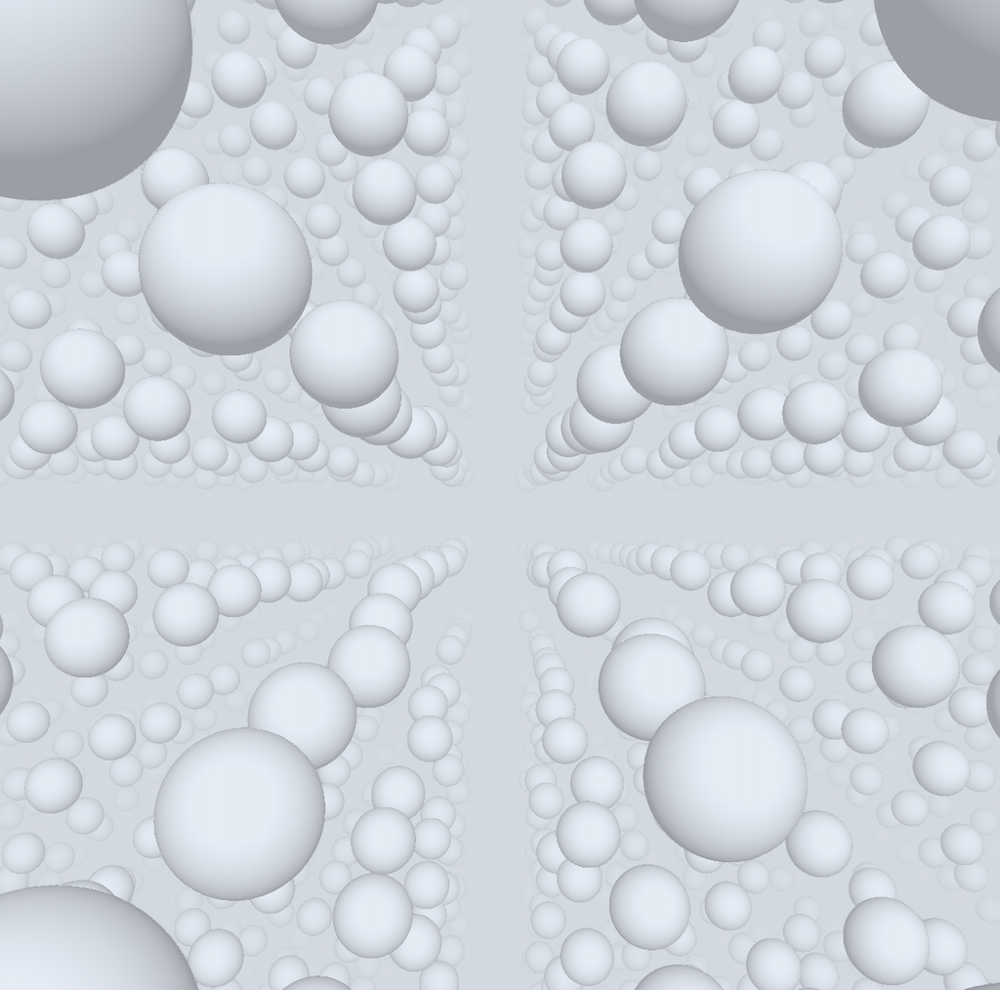]

--

.right-even[There are many possible representations for a geometric object in three dimensional space!
]

---
layout:false

## Geometry

.left-even[]

.right-even[There are many possible representations for a geometric object in three dimensional space!

* Polygonal meshes
* Parametric surfaces
* Subdivision surfaces
* Implicit surfaces
* etc.
]

---
layout:false

## Geometry

.left-even[]

.right-even[There are many possible representations for a geometric object in three dimensional space!

* Polygonal meshes
* Parametric surfaces
* Subdivision surfaces
* Implicit surfaces
* etc.

Which description is suitable depends on the context.

]


???
.task[COMMENT:]  

3
What do we need from shapes
in Computer Graphics?
* Local control of shape for modeling
* Ability to model what we need
* Smoothness and continuity
* Ability to evaluate derivatives
* Ability to do collision detection
* Ease of rendering
No single technique solves all problems!
https://viterbi-web.usc.edu/~jbarbic/cs420-s24/09-meshes/09-meshes.pdf


---
## Geometry

A rough analogy is to the different surface representations is to think about vector vs. raster graphics:

.center[  
.imgref[[[justcreative]](https://justcreative.com/raster-vs-vector-graphics-ultimate-guide/)]]

--

These are different representations for graphics with individual strengths and weaknesses.


???
.task[COMMENT:]  

More precisely, you call these two families of shapes in computer graphics:

* Parametric descriptions
* Implicit  descriptions

---
.header[Geometry]

## Polygon Mesh

--

.center[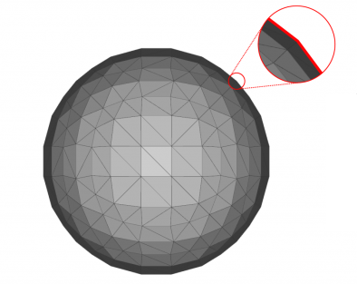]

A set of linked vertices.

---
.header[Geometry]

## Polygon Mesh

.center[]


???
.task[COMMENT:]  

Polygon Meshes  
• Any shape can be modeled out of  
polygons  
    – if you use enough of them…  
• Polygons with how many sides?  
    – Can use triangles, quadrilaterals,  
pentagons, … n-gons  
    – Triangles are most common.  
    – When > 3 sides are used, ambiguity about what to do  
when polygon nonplanar, or concave, or self-  
intersecting.  
• Polygon meshes are built out of  
    – vertices (points)  
    – edges (line segments between vertices)  
    – faces (polygons bounded by edges)  
  
Data Structures for Polygon Meshes  
• Simplest (but dumb)  
    – float triangle[n][3][3]; (each triangle stores 3 (x,y,z) points)  
    – redundant: each vertex stored multiple times  
• Vertex List, Face List  
    – List of vertices, each vertex consists of (x,y,z) geometric (shape)  
info only  
    – List of triangles, each a triple of vertex id’s (or pointers) topological  
(connectivity, adjacency) info only  
Fine for many purposes, but finding the faces adjacent to a vertex  
takes O(F) time for a model with F faces. Such queries are  
important for topological editing.  
• Fancier schemes:  
Store more topological info so adjacency queries can be answered in  
O(1) time.  
Winged-edge data structure – edge structures contain all topological  
info (pointers to adjacent vertices, edges, and faces).  
  
 OBJ file for a 2x2x2 cube  
v -1.0 1.0 1.0  // vertex 1  
v -1.0 -1.0 1.0 // vertex 2  
v 1.0 -1.0 1.0  // vertex 3  
v 1.0 1.0 1.0   
v -1.0 1.0 -1.0  
v -1.0 -1.0 -1.0  
v 1.0 -1.0 -1.0  
v 1.0 1.0 -1.0  
f 1 2 3 4  
f 8 7 6 5  
f 4 3 7 8  
f 5 1 4 8  
f 5 6 2 1  
f 2 6 7 3  

https://viterbi-web.usc.edu/~jbarbic/cs420-s24/09-meshes/09-meshes.pdf

---
.header[Geometry]

## Polygon Mesh


--

The good

--
* Simple definition (points and polygons)

--
* Easily exchangeable between programs

--
* Modern graphics hardware is really good and fast with processing and displaying meshes

--
* Lots of published research and algorithms for meshes

--
* You can associate specific colors with specific points on the mesh

---
.header[Geometry]

## Polygon Mesh


The bad

--
* As it is a **discrete** representation, it is potentially not smooth

--
* It is difficult to perform operations on the mesh shape

.footnote[[[Rhinoceros]](https://discourse.mcneel.com/t/mesh-or-surface-understanding-the-difference/75151/3)]


???
.task[COMMENT:]  

* Usually based on a parametric representation, from which it is easy to generate a triangle mesh

---
.header[Geometry]

## Parametric & Implicit Geometry

--

Analytically defined geometry, meaning a **function** or equations define the geometry.

--

.center[]


---
.header[Geometry]

## Parametric & Implicit Geometry

.center[.imgref[[[ntopology]](https://ntopology.com/blog/2019/05/13/implicits-and-fields-for-beginners/)]]

--

.center[.imgref[[[justcreative]](https://justcreative.com/raster-vs-vector-graphics-ultimate-guide/)]]

--

These representations can be understood as a *procedural modelling* technique.


---
.header[Geometry]

## Parametric & Implicit Geometry

> Instead of placing vertices, we describe shapes with functions.


---
.header[Geometry]

## Parametric Description


???
.task[COMMENT:]  

– e.g. plane, cylinder, bicubic surface, swept surface

--

.left-even[A sphere surface as function of two parameters, θ and ϕ:  

$x = r · cos ϕ · sin θ$  
$y = r · sin ϕ · sin θ$  
$z = r · cos ϕ $
]

.right-even[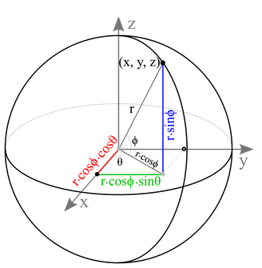 .imgref[[[songho]](https://www.songho.ca/opengl/gl_sphere.html)]]


???
.task[COMMENT:]  

* theta, phi
* Bezier curves and surfaces are an example of parametric shapes.
* We won't discuss in this lesson the differences between implicit and parametric forms
* How to find a point on the surface of the sphere?
    * You plug in values for θ, ϕ and r and with that you get the position of a point on the sphere. 

---
.header[Geometry]

## Parametric Description

.left-even[A sphere surface as function of two parameters, θ and ϕ:    

$x = r · cos ϕ · sin θ$  
$y = r · sin ϕ · sin θ$  
$z = r · cos ϕ $ 
  
<br >

This is *explicit* as you have explicit parameters.  


]

.right-even[ .imgref[[[songho]](https://www.songho.ca/opengl/gl_sphere.html)]]


???
.task[COMMENT:]  

* theta, phi
* Bezier curves and surfaces are an example of parametric shapes.
* We won't discuss in this lesson the differences between implicit and parametric forms
* How to find a point on the surface of the sphere?
    * You plug in values for θ, ϕ and r and with that you get the position of a point on the sphere. 

---
.header[Geometry]

## Parametric Description

.left-even[
The good
* Much more compact
* More convenient to control by editing control points
* Easy to construct from control points
]

--

.right-even[
The bad 
* Work well for smooth surfaces
* Must still split surfaces into discrete number of patches
* Rendering times are higher than for polygons
* Intersection test? Inside/outside test?
]

.footnote[[Jernej Barbic. [Polygon Meshes and Implicit Surfaces](https://viterbi-web.usc.edu/~jbarbic/cs420-s24/09-meshes/09-meshes.pdf). CSCI 420 Computer Graphics
Lecture 9. University of Southern California.]]

---
.header[Geometry]

## Implicit Geometry

--

.left-quarter[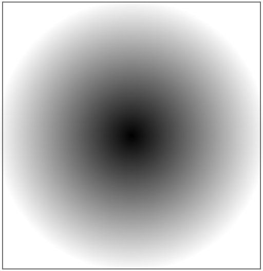]
.right-quarter[
```GLSL
void main()
{
    vec2 p = (2.0 * gl_FragCoord.xy - u_resolution.xy) 
                  / u_resolution.y;

    // distance of current coordinate to center
    float d = distance(p, vec2(0,0));
    gl_FragColor = vec4(vec3(d), 1.0);
}
```
]


???
.task[COMMENT:]  

* Now, we can add a radius variable and decide based on that radius and the distance, wether the currently computed pixel (aka point, aka xy or uv or st) is inside of the circle or not. Points inside the circle will have a distance from the center less than the radius, points on the circle will have distance equal to the radius, and points outside the circle will have distances greater than the radius.

---
.header[Geometry]

## Implicit Surfaces

.left-quarter[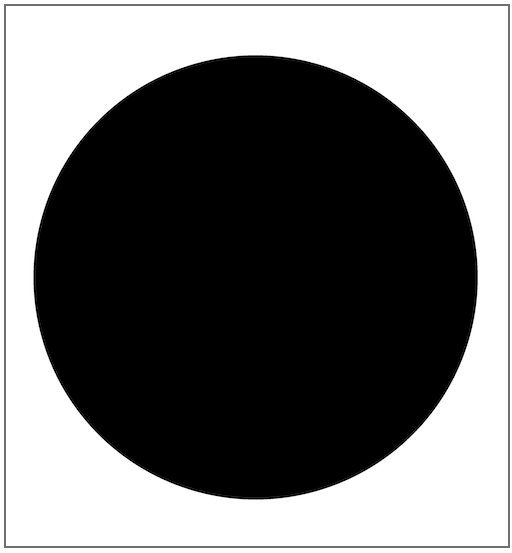]
.right-quarter[
```GLSL
void main()
{
    vec2 p = (2.0 * gl_FragCoord.xy - u_resolution.xy) 
                  / u_resolution.y;

    // distance of current coordinate to center
    float d = distance(p, vec2(0,0));

    // threshold color based on distance
    float radius = 0.8;
    vec3 color = d < radius ? vec3(0.) : vec3(1.0);

    gl_FragColor = vec4(color, 1.0);
}
```
]

???
.task[COMMENT:]  

* Now, we can add a radius variable and decide based on that radius and the distance, wether the currently computed pixel (aka point, aka xy or uv or st) is inside of the circle or not. Points inside the circle will have a distance from the center less than the radius, points on the circle will have distance equal to the radius, and points outside the circle will have distances greater than the radius.

---
.header[Geometry]

## Parametric & Implicit Geometry


.left-even[
Parametric  
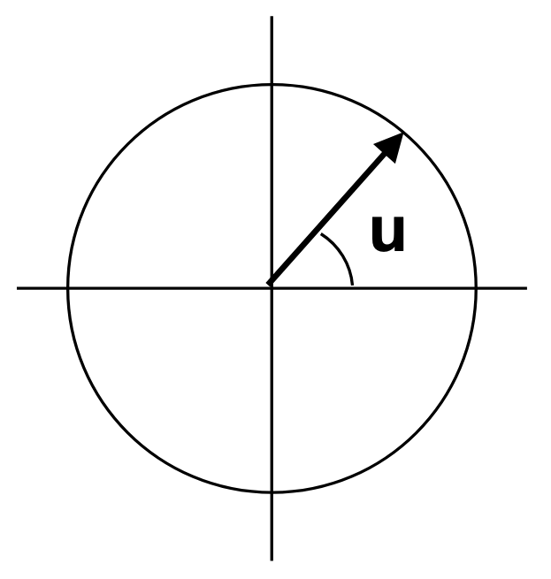  
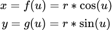 
]


--

.right-even[
Implicit  
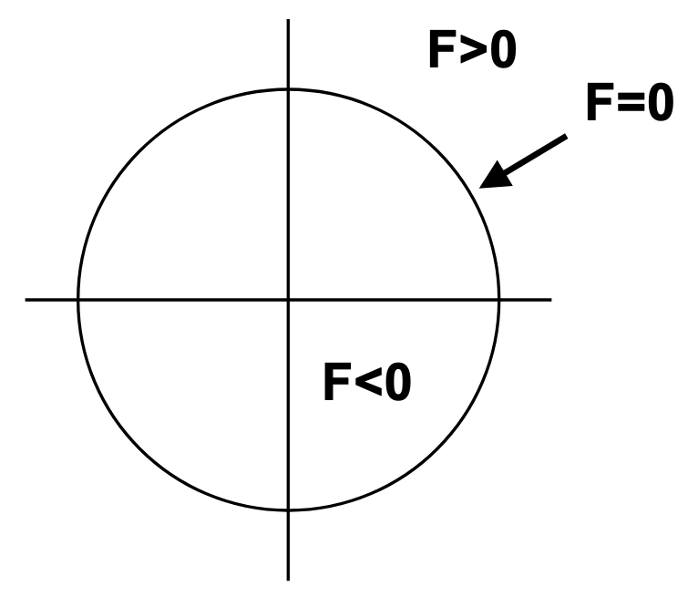  
$F(x,y) = x^2 + y^2 - r^2$
]


---
.header[Geometry | Implicit Surfaces]

## Sphere Surface Description

> Set the coordinates in relationship to each other in order to describe a shape.
  
  
--

This is an *implicit* description.

---
.header[Geometry | Implicit Surfaces]

## Sphere Surface Description

Every point on the surface has the same distance, namely the radius, to its center.  

--

$x^2+y^2 = r^2$


???
.task[COMMENT:]  

* Hence, in implicit form as quadratic function you can describe a sphere at the origin as 

--

Solve it as quadratic function

$x^2+y^2-r^2 = 0$

--

Setting $r^2$ to a constant will return a sphere with radius $r$:
  
$F(x,y) = x^2+y^2 - r$  

--

```glsl
float sphere(vec2 p, float r)
{
    return length(p) - r;
}
```

---
.header[Geometry | Implicit Surfaces]

## Sphere Surface Description


You can think of an implicit function as a function that represents many surfaces that are sort of laid out as layers.  

--

For a sphere the layer depends on the given $r$:

.left-even[  [[Inigo Quilez]](https://www.iquilezles.org/www/articles/distfunctions2d/distfunctions2d.htm)]  

--

.right-even[
Centered at the origin:

```glsl
float sphere(vec2 p, float r)
{
    return length(p) - r;
}
```
]


---
.header[Geometry]
## Implicit Surfaces

  
Solving for  

$x^2+y^2+z^2 − r=0$

--

will tell you wether you are **outside**, **inside** or **on** the surface of the sphere. 


???
.task[COMMENT:]  

* How to find a point on the surface of the sphere?
* All an implicit representation says is that points that actually lie on the surface of the sphere, in other words all points making up the surface of the sphere or its isosurface, satisfy this equation.
* The formula results in 0 for a given point, if it is on the surface. 
* (Hence, for *implicit* surfaces the actual surface is not directly defined.)

--

> What the implicit representation computes is also called the ***Signed Distance Function*** of a sphere.

---
.header[Geometry | Implicit Surfaces]

## Signed Distance Function (SDF)

.left-even[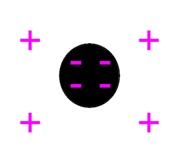]

--

.right-even[
If the point is 


]

---
.header[Geometry | Implicit Surfaces]

## Signed Distance Function (SDF)

.left-even[]


.right-even[
If the point is 

* inside the object, the distance is negative,

]

---
.header[Geometry | Implicit Surfaces]

## Signed Distance Function (SDF)

.left-even[]


.right-even[
If the point is 

* inside the object, the distance is negative,
* outside the surface, the distance will be positive, and

]

---
.header[Geometry | Implicit Surfaces]

## Signed Distance Function (SDF)

.left-even[]


.right-even[
If the point is 

* inside the object, the distance is negative,
* outside the surface, the distance will be positive, and
* on the surface, the distance is 0.

]

---
.header[Geometry | Implicit Surfaces]

## Signed Distance Function (SDF)

.left-even[]


.right-even[
If the point is 

* inside the object, the distance is negative,
* outside the surface, the distance will be positive, and
* on the surface, the distance is 0.

The collection of points that lie exactly on the surface are called an *isosurface*.
]


---
.header[Geometry | Implicit Surfaces]

## Sphere Surface Description

.left-quarter[]
.right-quarter[
```GLSL
float sdf_circle(vec2 p, float radius)
{
    return length(p) - radius;
}

void main()
{
    vec2 p = (2.0 * gl_FragCoord.xy - u_resolution.xy) / u_resolution.y;
    
    float radius = 0.2;
    float d = sdf_circle(p, radius);

    vec3 color = d < 0. ? vec3(0.) : vec3(1.);
    fragColor = vec4(color, 1.0);
}
```
]

---
.header[Geometry]
## Implicit Surfaces

???
.task[COMMENT:]  

* Analytically defined geometry, meaning a **function** or equations define the geometry. 

--

.left-even[
The good
* Any resolution and scale
* Accurate
* Operators to combine shapes
* Small memory footprint 
* Can be evaluated for any coordinate without context about the neighborhood
]

--

.right-even[
The bad
* The maths involved might be difficult
* Topologically limited 
]


---
.header[Geometry]
## Implicit Geometry

.center[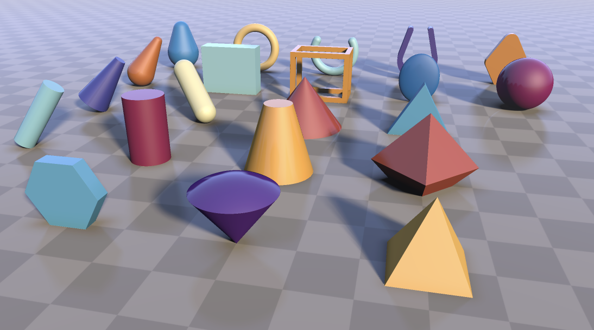 .imgref[[[3D Primitives]](https://www.shadertoy.com/view/Xds3zN)]]

???
.task[COMMENT:]  

* [2D SDF Functions](https://iquilezles.org/articles/distfunctions2d/)
* https://www.shadertoy.com/results?query=tag%3Dsdf


---
template:inverse


# Combining Distance Functions

---
.header[Geometry]

## Combining Distance Functions

You can easily combine functions to create **composite shapes**. 


???
.task[COMMENT:]  

* One of the cool properties of this representation is that you can combine them to create composite shapes. For example, for the union of shapes, we take the minimum values of all computed distance functions:


---
## Combining Distance Functions

.left-even[ ]


???
.task[COMMENT:]  

* How to add surfaces?


--

.right-even[

<br >
Union

* the minimum values of all computed distance functions
]


---
.header[Geometry | Combining Distance Functions]


```glsl
void main()
{
    vec2 p = (2.0 * gl_FragCoord.xy - u_resolution.xy) / u_resolution.y;
    float radius = 0.2;

    // The circles
    vec2 circle1_center = vec2(.5, 0.);
    vec2 circle2_center = vec2(-0.5, 0.);
    vec2 circle3_center = vec2(sin(u_time) * 0.4, 0.);
    float circle1 = sdf_circle(p - circle1_center, radius);
    float circle2 = sdf_circle(p - circle2_center, radius);
    float circle3 = sdf_circle(p - circle3_center, radius / 1.8);

    // Union of shapes 
    float d = min(circle1, circle2);
    d = min(d, circle3);

    // threshold color based on distance
    vec3 color = d < 0. ? vec3(0.) : vec3(1.);
    fragColor = vec4(color, 1.0);
}
```

???
.task[COMMENT:]  

*  implicit_geometry_02_combined.frag

---
## Combining Distance Functions

.left-even[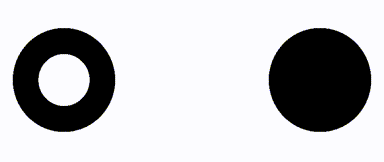 ]


???
.task[COMMENT:]  

* How to create this scenario?


--

.right-even[

<br >
Intersection

* the max of two distances and multiplying that to the original value
]

???
.task[COMMENT:]  

* Aussen: + und - vom kleinen Kreis, ergibt wieder +
* Innen: - und - vom kleinen Kreis, ergibt - mal - = +
* https://www.shadertoy.com/view/tsdXD4


---
## Combining Distance Functions

.left-even[ ]

.right-even[

<br >
Intersection

* the max of two distances and multiplying that to the original value

```glsl
...
    // Intersection
    float d = min(circle1, circle2);
    d *= max(d, circle3);
...
```
]

???
.task[COMMENT:]  

* Aussen: + und - vom kleinen Kreis, ergibt wieder +
* Innen: - und - vom kleinen Kreis, ergibt - mal - = +
* https://www.shadertoy.com/view/tsdXD4

---
## Combining Distance Functions

.right-even[

<br >
At some point, I had accidentally put a `+`... with an interesting result:

```glsl
...
    // Intersection
    float d = min(circle1, circle2);
    d *= max(d, circle3);
...
```
]

--


.left-even[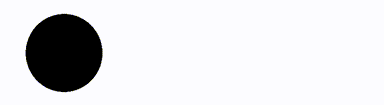 ]

---
## Combining Distance Functions

.left-even[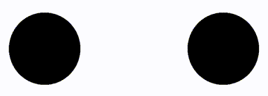 ]


???
.task[COMMENT:]  

* How to create this scenario?


--

.right-even[

<br >
Smoothing out the intersection of the union of objects with a a [smooth minimum](https://www.iquilezles.org/www/articles/smin/smin.htm).

]

???
.task[COMMENT:]  


* Instead of finding a simple union or intersection, you can compute what is called a [smooth minimum](https://www.iquilezles.org/www/articles/smin/smin.htm). Essentially this allows you to take the union of two objects, and smooth out the intersection point. This allows shapes to blend together as they get near each other. 


---
## Combining Distance Functions

.left-even[ ]


.right-even[

<br >
Smoothing out the intersection of the union of objects with a a [smooth minimum](https://www.iquilezles.org/www/articles/smin/smin.htm).

```glsl
...
    // Smooth Minimum
    float d = min(circle1, circle2);
    d = smin(d, circle3, 0.2);
...
```
]

???
.task[COMMENT:]  


---
## Combining Distance Functions

.left-even[ `k = 0.5`  

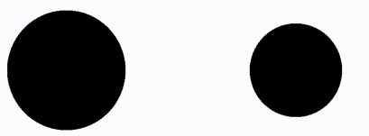 `k = 0.2`  
]


.right-even[

<br >
Smoothing out the intersection of the union of objects with a a [smooth minimum](https://www.iquilezles.org/www/articles/smin/smin.htm).

```glsl
...
    // Smooth Minimum
    float d = min(circle1, circle2);
    d = smin(d, circle3, 0.2);
...
```

`k`: how much to keep the original shape 


]

.footnote[[[blog.sb1.io]](https://blog.sb1.io/intro-to-2d-signed-distance-functions/)]


---
.header[Geometry]

## Combining Distance Functions

Making it interactive (the smaller circle is controlled by the mouse)

.left-even[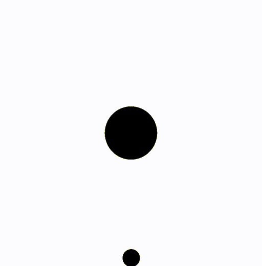]


--
.right-even[
> Don't forget to normalize the mouse position as well!
]


---
.header[Implicit Surfaces]

## Rectangle Surface Description

--

.left-even[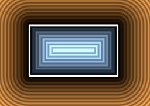  
.imgref[[[Inigo Quilez]](https://www.iquilezles.org/www/articles/distfunctions2d/distfunctions2d.htm)]]

--

.right-even[
Centered at the origin:

```glsl
float sdf_rect(vec2 p, vec2 size)
{
    vec2 d = abs(p) - size;

    return length(max(d,0.0)) 
            + min(max(d.x,d.y),0.0);
}
```
]


???
.task[COMMENT:]  

* TASK: Herleitug


---
.header[Geometry]

## Implicit Geometry

> But how to render this in 3D?  
  

--
We need a "ray hits surface" test...

# 🤔


???
.task[COMMENT:]  

* Any ideas for a "ray hits surface" test?
* We can easily test whether the current origin of a ray is inside the shape by computing its signed distance to the isosurface.  
* SDF Gives us information about where the ray's origin is located in space with respect to the surface...
* ...but not where the ray intersects the object (assuming the ray intersects it at all)  
* This gives us some information about where the ray's origin is located in space with respect to the surface but not where the ray intersects the object (assuming the ray intersects it at all).  


---
template:inverse

# ✨ 
#### The End


---
# Exercise

--
1. Create a 2D scene that is animated and / or interactive. Feel free to look up further [2D SDF Functions](https://iquilezles.org/articles/distfunctions2d/).

--
2. Try to understand scene [`implicit_geometry_05_colored.frag`](https://ctechfilmuniversity.github.io/workshop_shader_programming/code/implicit_geometry_05_colored.html) as much as you can.

