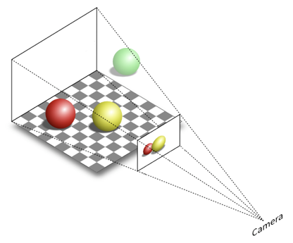
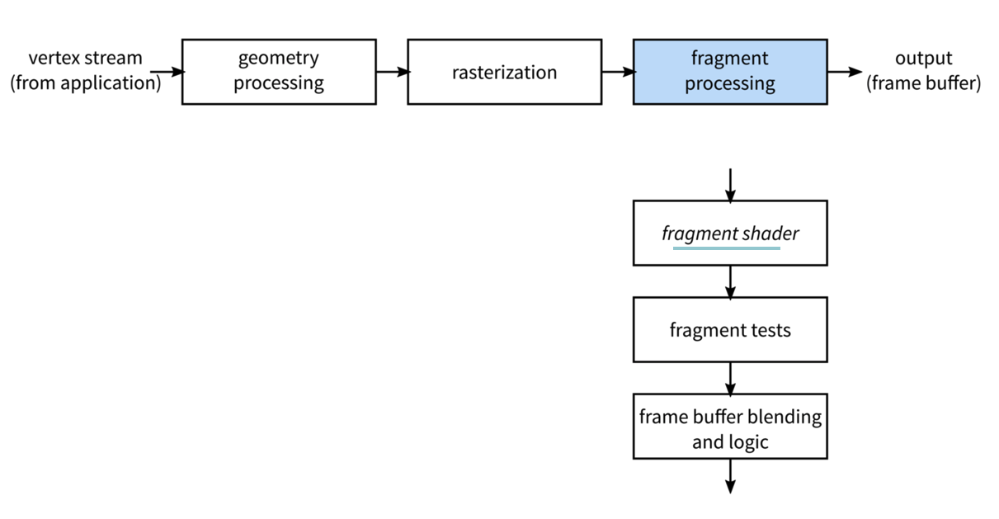
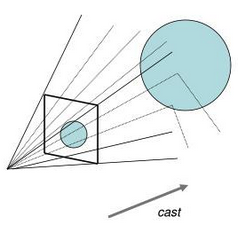
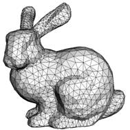
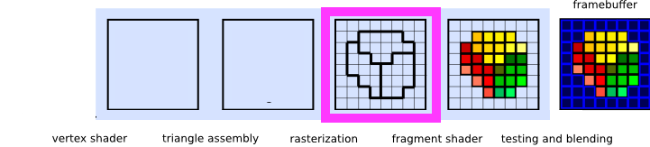

name: inverse
layout: true
class: center, middle, inverse
---


# Shader Programming Workshop

#### Prof. Dr. Lena Gieseke | l.gieseke@filmuniversitaet.de  
#### Film University Babelsberg KONRAD WOLF

<br >

## *3D Scene Rendering*


<!--
Start server in /doc/

h or ?: Toggle the help window
j: Jump to next slide
k: Jump to previous slide
b: Toggle blackout mode
m: Toggle mirrored mode.
c: Create a clone presentation on a new window
p: Toggle PresenterMode
f: Toggle Fullscreen
t: Reset presentation timer
<number> + <Return>: Jump to slide <number>
-->


---
layout: false


## Preview

.center[]


---
template: inverse

# 3D Scene Rendering

---

## 3D Scene Rendering


???
.task[COMMENT:]  

* In the most basic sense what is 3D scene rendering?

--

Rendering is the process of generating an image from a 3D scene representation. 

Hence, we need to convert a 3D scene into a 2D raster. 

--

.center[]

---

## 3D Scene Rendering

.center[]  .imgref[[[techspot]](https://www.techspot.com/article/1888-how-to-3d-rendering-rasterization-ray-tracing/)]

---

## Rendering Algorithms

???
.task[COMMENT:]  

There are several rendering algorithms in countless flavors. The two main categories are: 

--

### Rasterization vs. Ray Tracing

.center[]

.footnote[[[wiki](https://www.wikiwand.com/en/Rendering),[Raytracing and Global Illumination](https://www.slideserve.com/tender/raytracing-and-global-illumination) ]]


???
.task[COMMENT:]  


* Rasterization
    * Projects polygons onto the picture plane, without advanced optical effects
    * Very Fast
* Raytracing
    * Cast rays through the picture plane into the scene from a specific point of view, can employ more advanced optical simulation
* The fourth type of light transport technique, radiosity is not usually implemented as a rendering technique, but instead calculates the passage of light as it leaves the light source and illuminates surfaces. These surfaces are usually rendered to the display using one of the other three techniques.
* Another distinction is between image order algorithms, which iterate over pixels of the image plane, and object order algorithms, which iterate over objects in the scene. Generally object order is more efficient, as there are usually fewer objects in a scene than pixels. 

---

## Rendering Algorithms

### Rasterization vs. Ray Tracing

> Most advanced software combines techniques to obtain good-enough results at reasonable cost!


???
.task[COMMENT:]  

* Rasterisation is what renders the polygons, and it’s then combined with shadows and reflections created using Ray Tracing.
* What is GPU rendering?

---
template:inverse

# Rasterization

---
.header[Rendering Algorithms]

## Rasterization

.center[]

.footnote[[Image Synthesis Lecture, M. Fuchs, 2016]]
 
---
.header[Rendering Algorithms]

## Rasterization


.footnote[[Image Synthesis Lecture, M. Fuchs, 2016]]
 
  
> The mapping of the scene geometry to pixels.


???
.task[COMMENT:]  

* Rasterization
    * Projects polygons onto the picture plane, without advanced optical effects
    * Very Fast

* The main problem with rasterization is that this technique has a difficult time tracking exactly how the light in a scene should travel and interact with other elements of the scene. 

---
.header[Rendering Algorithms]

## Rasterization

.center[]

???
.task[COMMENT:]  

* The **vertex shader** is responsible for the transformations applied on the vertices; mainly, the coordinate transforms required for the position, but it can also perform other calculations (e.g. Gouraud shading).
* The **geometry shader** is able to remove and insert primitives into the primitive stream, right before actual rasterization begins.
* **Tesselation shaders** are newer than geometry shaders, but come earlier in the pipeline. They were introduced, because
    * geometry shaders were not general enough (what if we need more data for subdivision than the _ADJACENCY primitives can carry?)
    * subdivision is a very common problem, but complicated to implement, and it would make sense to centralize some support.
* As a solution, OpenGL includes tesselation shaders, and splits the tesselation problem into three subcomponents:
    * The tesselation control shader decides into how many primitives the incoming GL_PATCH should be subdivided (and additional details)
    * The hard-coded tesselation primitive generator performs the actual subdivision
    * The tesselation evaluation shader gets to move the patch vertices resulting from the subdivision.

---
.header[Rendering Algorithms]

## Rasterization

.center[]

.footnote[[Image Synthesis Lecture, M. Fuchs, 2016]]

---
.header[Rendering Algorithms]

## Rasterization

.center[]

.footnote[[Image Synthesis Lecture, M. Fuchs, 2016]]

???
.task[COMMENT:]  

* The fragment shader is used for shading. It defines the the look of the fragments, can modify output color and depth and can discard fragments from the pipeline.


.center[]


* Applying transformations can be understood as a change of coordinate systems (change of base + change of origin).
    * In image order rendering, we usually transform the viewing ray into the local coordinate system.
    * In object order rendering, we transform the primitives into screen coordinates (where rasterization takes place).
* It makes many transformations invertible: thus, we can easily change our perspective between “moving the camera” and “moving the object”.


---
template:inverse

# Ray Tracing

---
.header[Rendering Algorithms]

## Ray Tracing

.center[]


???
.task[COMMENT:]  

* Raytracing
    * Cast rays through the picture plane into the scene from a specific point of view, can employ more advanced optical simulation

---
.header[Rendering Algorithms]

.center[  
Underweysung der Messung (Nuremberg, 1525) .imgref[[[nvidia]](https://blogs.nvidia.com/blog/2022/03/23/what-is-path-tracing/)]]


???
.task[COMMENT:]  

* The string’s the thing: Albrecht Dürer was the first to describe what’s now known as “ray tracing,” a technique for creating accurate representations of 3D objects on a 2D surfaces in Underweysung der Messung (Nuremberg, 1525),f15
* Dürer made it his life’s work to bring classical and contemporary mathematics together with the arts, achieving breakthroughs in expressiveness and realism.
* In 1969, more than 400 years after Dürer’s death, IBM’s Arthur Appel showed how the idea of ray tracing could be brought to computer graphics, applying it to computing visibility and shadows.
* A decade later, Turner Whitted was the first to show how this idea could capture reflection, shadows and refraction, explaining how the seemingly simple concept could make much more sophisticated computer graphics possible. Progress was rapid in the following few years.
* In 1984, Lucasfilm’s Robert Cook, Thomas Porter and Loren Carpenter detailed how ray tracing could incorporate many common filmmaking techniques — including motion blur, depth of field, penumbras, translucency and fuzzy reflections — that were, until then, unattainable in computer graphics.

---
.header[Rendering Algorithms]

## Ray Tracing

Ray Tracing is also called physically-based rendering and is based on the properties of light.

--
* Light is emitted by light sources

--
* Light is transported through the scene by reflection at surfaces

--
* Some of the light ends up in the eye

---
.header[Rendering Algorithms]

## Ray Tracing

Ray Tracing is also called physically-based rendering and is based on the properties of light.


.center[]

???

.task[TASK:] Who can explain the algorithm?

---
.header[Rendering Algorithms]

## Ray Tracing

Light transport is reversible with respect to time and we can trace the light rays backwards, starting in the eye, ending in the light source.

---
.header[Rendering Algorithms]

## Ray Tracing

.left-even[]

--

.right-even[
Advantage: We are only interested in the light that hits the eye, anyways!
]

---
.header[Rendering Algorithms]

## Ray Tracing

.left-even[]

.right-even[
For every point on the image plane
]

---
.header[Rendering Algorithms]

## Ray Tracing

.left-even[]

.right-even[
For every point on the image plane  

* cast a ray from the eye into the scene,
]

---
.header[Rendering Algorithms]

## Ray Tracing

.left-even[]


.right-even[
For every point on the image plane  

* cast a ray from the eye into the scene,
* determine color and brightness of the light that travels on that ray to the eye and
]

---
.header[Rendering Algorithms]

## Ray Tracing

.left-even[]

.right-even[
For every point on the image plane  

* cast a ray from the eye into the scene,
* determine color and brightness of the light that travels on that ray to the eye and
* store it at the image point.
]

???

Dedicated hardware has remained exotic, but general purpose GPU computing is becoming the standard.

Cons

* Hard to pipeline
* Usually needs preprocessing
* Typically higher runtime requirements than for object order rendering

Pros

* “Embarrassingly” parallel
* Every pixel can be computed independently, and needs to be written to only once
* Scales well with scene complexity
* Methodically uncomplicated


???
.task[COMMENT:]  

* The various rendering techniques in computer graphics attempt to solve and approximate this equation. 

---
.header[Rendering Algorithms]

## Ray Tracing

Ray Tracing is easy to implement!

--

In C++ in 99 lines: http://www.kevinbeason.com/smallpt/#moreinfo 😁

---
.header[Rendering Algorithms]

## Ray Tracing
```
// loop over all pixels
Vec3f framebuffer = new Vec3f[imageHeight][imageWidth]; 
for (int j = 0; j < imageHeight; ++j) { 
    for (int i = 0; i < imageWidth; ++i) { 
        for (int k = 0; k < numObjectsInScene; ++k) { 

            Ray ray = buildCameraRay(i, j); 

            if (intersect(ray, objects[k]) { 
                framebuffer[j][i] = objects[k].color; 
            } 
            else { 
               framebuffer[j][i] = backgroundColor; 
            } 
        } 
    } 
} 
```


---
.header[Rendering Algorithms]

## Ray Tracing

> However, there are worlds, or better universes, between the *basic* algorithm and *making it look good* on a professional or production level.


???
.task[COMMENT:]  

* A better implementation is possible, as for example demonstrated here: http://madebyevan.com/webgl-path-tracing/  


---
.header[Rendering Algorithms]

## Ray Tracing

Ray Tracing comes in many flavors

--

* Ray Casting
* Path Tracing
* Ray Marching
* ...


???
.task[COMMENT:]  

* Ray Casting
    * Simplest form of ray tracing
    * Cast a ray for each pixel (or vertical scanline) of the image plane
    * Solve ray-surface intersection test
* Path Tracing
    * Solve the rendering equation via Monte-Carlo integration
    * Trace a rays with weighted random reflections/transmissions
    * Multiple iterations are required to avoid noisy images
* Ray Marching
    * Also known as sphere marching
    * Objects and scenes are represented as distance fields
    * Resulting image is calculated by marching through the distance field

---
.header[Rendering Algorithms | Ray Tracing]

## Path Tracing

Some form of path tracing is the core of most high-quality render engines.

.center[ .imgref[[[nvidia]](https://developer.nvidia.com/rtx/raytracing)]]


???
.task[COMMENT:]  

* The rendering equation is concise, but not easy to solve. Computer graphics scenes are complex, with billions of triangles not being unusual today. There’s no way to solve the rendering equation directly, which led to Kajiya’s second crucial innovation.
* Kajiya showed that statistical techniques could be used to solve the rendering equation: even if it isn’t solved directly, it’s possible to solve it along the paths of individual rays. If it is solved along the path of enough rays to approximate the lighting in the scene accurately, photorealistic images are possible.
* By putting these two ideas together — a physics-based equation for describing the way light moves around a scene — and the use of Monte Carlo simulation to help choose a manageable number of paths back to a light source, Kajiya outlined the fundamental techniques that would become the standard for generating photorealistic computer-generated images.
* His approach transformed a field dominated by a variety of disparate rendering techniques into one that — because it mirrored the physics of the way light moved through the real world — could put simple, powerful algorithms to work that could be applied to reproduce a large number of visual effects with stunning levels of realism.
* https://www.nvidia.com/en-us/on-demand/session/gtcspring22-s43047/

---
## Rendering Algorithms

.center[ .imgref[[[nvidia]](https://blogs.nvidia.com/blog/2022/03/23/what-is-path-tracing/)]]


???
.task[COMMENT:]  

* https://blogs.nvidia.com/blog/2022/03/23/what-is-path-tracing/


---
.header[Rendering Algorithms]

## Ray Tracing

.left-even[]

.right-even[
For every point on the image plane  

* cast a ray from the eye into the scene,
* **determine color and brightness** of the light that travels on that ray to the eye and
* store it at the image point.
]

---
.header[Rendering Algorithms | Ray Tracing]

## Ray - Object Intersection

Classical ray tracing algorithms solve the intersection of a ray and an object algebraically.

--

For triangulated meshes, [ray-triangle intersections](https://www.scratchapixel.com/lessons/3d-basic-rendering/ray-tracing-rendering-a-triangle/ray-triangle-intersection-geometric-solution.html) are performant to compute.

--
.left-even[]

.right-even[] .imgref[[[courses.cs.washington.edu]](https://courses.cs.washington.edu/courses/cse457/04sp/lectures/triangle_intersection.pdf)]

---
.header[Rendering Algorithms]

## Ray Tracing

But what to do if we do not have nicely triangulated meshes...  

--
  
...as in an "empty" fragment shader?

--

.center[]


---
template:inverse

# Ray Marching


---
.header[Rendering Algorithms | Ray Tracing]

## Ray Marching

--

With the gained popularity of real-time solutions and rendering in the fragment shader, the need for

--
* lighter scene representations

--
* flexible ray intersection algorithms

--

became more prominent.

--

<br >
*Ray marching* or better *sphere tracing* is a solution for that.


???
.task[COMMENT:]  

Later:
* Instead of computing the intersection of a ray with a surface directly, ray marching steps along the ray until an intersection is found.
* the main difference between ray casting and ray marching, is the fact that ray casting uses explicit equations while ray marching uses implicit equations to render the scene.
* Raycasting is good for immediately getting the intersection if one exists. Raymarching is good for objects that cannot be described easily in a simple equation.


---
template:inverse

# The Rendering Scenario


---

## The Rendering Scenario

.left-even[]

--
.right-even[
> How to determine the color of each fragment?
]

---

## The Rendering Scenario

.left-even[]

.right-even[
1. Shoot a ray through each fragment into the scene.
]

---

## The Rendering Scenario

.left-even[]

.right-even[
1. Shoot a ray through each fragment into the scene
2. Detect the surface a ray hits and use the surface color for the fragment

]


---

## The Rendering Scenario

.center[]


---

## The Rendering Scenario

.center[]

.footnote[[based on: [scratchapixel](https://www.scratchapixel.com/lessons/3d-basic-rendering/introduction-to-ray-tracing)]]


---
## The Rendering Scenario

.center[]
.footnote[[based on: [scratchapixel](https://www.scratchapixel.com/lessons/3d-basic-rendering/introduction-to-ray-tracing)]]


<!-- ---
## Rendering

.center[]
.footnote[[based on: [scratchapixel](https://www.scratchapixel.com/lessons/3d-basic-rendering/introduction-to-ray-tracing)]]
 -->


---
## The Rendering Scenario

.center[]
.footnote[[based on: [scratchapixel](https://www.scratchapixel.com/lessons/3d-basic-rendering/introduction-to-ray-tracing)]]

---
## The Rendering Scenario

.center[]
.footnote[[based on: [scratchapixel](https://www.scratchapixel.com/lessons/3d-basic-rendering/introduction-to-ray-tracing)]]

---
## The Rendering Scenario

.left-even[]

.right-even[
```glsl
// Camera
// Position
vec3 ray_origin = vec3(0, 0.1, -2);

// Direction
// Shooting a ray "through" the current fragment
vec3 ray_direction = 
        normalize(vec3(p, 1));
```
]


---
## The Rendering Scenario

.left-even[]

.right-even[
> How to determine the color of each fragment?

1. Shoot a ray through each fragment into the scene. ✓
2. Detect the surface a ray hits and use the surface color for the fragment.

]

---
## The Rendering Scenario

.left-even[]

.right-even[
> How to determine the color of each fragment?

1. Shoot a ray through each fragment into the scene. ✓
2. Detect the surface a ray hits and use the surface color for the fragment.

]


---
## The Rendering Scenario

.left-even[]

.right-even[
> How to determine the color of each fragment?

1. Shoot a ray through each fragment into the scene. ✓
2. Detect the surface a ray hits and use the surface color for the fragment.
]

.footnote[[[scratchapixel]](https://www.scratchapixel.com/lessons/3d-basic-rendering/introduction-to-ray-tracing)]

---
## The Rendering Scenario

.left-even[]

.right-even[
> How to determine the color of each fragment?

1. Shoot a ray through each fragment into the scene. ✓
2. Detect the surface a ray hits and use the surface color for the fragment.
]

.footnote[[[scratchapixel]](https://www.scratchapixel.com/lessons/3d-basic-rendering/introduction-to-ray-tracing)]


---
## The Rendering Scenario

.left-even[]

.right-even[
> How to detect where a ray hits a surfaces?
]

.footnote[[[scratchapixel]](https://www.scratchapixel.com/lessons/3d-basic-rendering/introduction-to-ray-tracing)]


---
## The Rendering Scenario

.left-even[]

.right-even[

<br/>

For all objects in the scene, which one is hit, if at all?
]

.footnote[[[scratchapixel]](https://www.scratchapixel.com/lessons/3d-basic-rendering/introduction-to-ray-tracing)]

---

.header[The Rendering Scenario]
## Implicit Geometry

Strictly speaking, we don't even have a "surface" but a function...

--

.left-even[  .imgref[[[Inigo Quilez]](https://www.iquilezles.org/www/articles/distfunctions2d/distfunctions2d.htm)]]

.right-even[
```glsl
float sdfCircle(vec2 p, float r)
{
    return length(p) - r;
}
```
]


---

.header[The Rendering Scenario]
## Implicit Geometry

Strictly speaking, we don't even have a "surface" but a function...

.left-even[  .imgref[[[Inigo Quilez]](https://www.iquilezles.org/www/articles/distfunctions2d/distfunctions2d.htm)]]

.right-even[
```glsl
float sdfCircle(vec2 p, float r)
{
    return length(p) - r;
}
```
...and properties that we can work with.
]


---
template:inverse

# Sphere Tracing

---
.header[Rendering | Implicit Geometry]

## Ray Marching

--

.center[]

---
.header[Rendering | Implicit Geometry]

## Ray Marching

.center[]

---
.header[Rendering | Implicit Geometry]

## Ray Marching

.center[]

---
.header[Rendering | Implicit Geometry]

## Ray Marching

.center[]


???
.task[COMMENT:]  

* What could be the issue here, regarding performance?

---
.header[Rendering | Implicit Geometry]

## Ray Marching

Sphere tracing implements smarter step sizes.

--

> The next step size is the smallest distance to all surfaces.

---
.header[Rendering | Implicit Geometry]

## Ray Marching

.center[]

.footnote[[[Sebastian Lague]](https://www.youtube.com/watch?v=Cp5WWtMoeKg&t=3s)]

---
.header[Rendering | Implicit Geometry]

## Sphere Tracing

.center[]

.footnote[[[Sebastian Lague]](https://www.youtube.com/watch?v=Cp5WWtMoeKg&t=3s)]


???
.task[COMMENT:]  

* This algorithm is called *sphere tracing* because when you compute the smallest distance from a point to all surfaces, this distance can be seen as the radius of a sphere within which we can move freely without ever intersecting with a surface. 

---
.header[Rendering | Implicit Geometry]

## Sphere Tracing

> This algorithm is called *sphere tracing* because when you compute the smallest distance from a point to all surfaces, this distance can be seen as the radius of a sphere within which we can move freely without ever intersecting with a surface. 
  
Hart, John. (1995). Sphere Tracing: A Geometric Method for the Antialiased Ray Tracing of Implicit Surfaces. The Visual Computer. 12. 10.1007/s003710050084. 

---
.header[Rendering | Implicit Geometry]

## Sphere Tracing

.center[]

.footnote[[[Sebastian Lague]](https://www.youtube.com/watch?v=Cp5WWtMoeKg&t=3s)]

---
.header[Rendering | Implicit Geometry]

## Sphere Tracing

.center[]

.footnote[[[Sebastian Lague]](https://www.youtube.com/watch?v=Cp5WWtMoeKg&t=3s)]

---
.header[Rendering | Implicit Geometry]

## Sphere Tracing

.center[]

.footnote[[[Sebastian Lague]](https://www.youtube.com/watch?v=Cp5WWtMoeKg&t=3s)]

---
.header[Rendering | Implicit Geometry]

## Sphere Tracing

.center[   
We stop once the next step size is below a certain threshold.
]

.footnote[[[Sebastian Lague]](https://www.youtube.com/watch?v=Cp5WWtMoeKg&t=3s)]


---
.header[Rendering | Implicit Geometry]

## Sphere Tracing

> How do we get the smallest distance to all surfaces?

--

* We iterate over all surfaces,

--
* and compute the distance to each surface.

--

The distance computation from a point to the surface depends on the different shapes!  

---
.header[Rendering | Implicit Geometry | Sphere Tracing]

## Distance Implicit Functions 

For basic shapes there are simple mathematical formula for this.


???
.task[COMMENT:]  

* DIFs


---
.header[Sphere Tracing | Distance Implicit Function]

## Closest Distance To a Sphere

.left-even[]


---
.header[Sphere Tracing | Distance Implicit Function]


## Closest Distance To a Sphere

.left-even[]

.right-even[

* Distance point to circle center:  
$||P - C||$
]


???
.task[COMMENT:]  

* With ||P - C|| as squared distance `sqrtf(x*x+y*y+z*z)`


---
.header[Sphere Tracing]

## Closest Distance To a Sphere

.left-even[]

.right-even[

* Distance point to circle surface:  
$||P - C|| - r$
]


---
.header[Sphere Tracing | Distance Implicit Function]


## Closest Distance To a Sphere

.left-even[]

.right-even[

> The closest distance from the point P to a sphere is just the distance to the center of the sphere minus the sphere's radius.  
  
$d(P,Sphere)=||P - C|| − r$ 
]


---
.header[Sphere Tracing | Distance Implicit Function]


## Closest Distance To a Sphere

.left-even[]

.right-even[

> The closest distance from the point P to a sphere is just the distance to the center of the sphere minus the sphere's radius.  
  
$d(P,Sphere)=||P - C|| − r$  
  
<br >
This is the *distance implicit function* of a sphere.  
]


---
.header[Sphere Tracing | Distance Implicit Function]

## Closest Distance To a Sphere

.left-even[]

.right-even[

> The closest distance from the point P to a sphere is just the distance to the center of the sphere minus the sphere's radius.  
  
$d(P,Sphere)=||P - C|| − r$  
  
<br >
Important: this equation assumes that the the center of the sphere is at the origin! 
]

???
.task[COMMENT:]  

* Next week we will learn how to deal with transformations such as scale, rotation and translation. But for now, we will assume a the shape centred around the origin.


---
.header[Sphere Tracing | Distance Implicit Function]

## Closest Distance To a Sphere

.center[]

---
.header[Sphere Tracing | Distance Implicit Function]

## Closest Distance To a Sphere

.center[]

---
.header[Sphere Tracing | Distance Implicit Function]

## Closest Distance To a Sphere

.center[]


---
.header[Sphere Tracing | Distance Implicit Function]

## Closest Distance To a Plane

For a plane that is parallel to one of the axis of the coordinate system, we can simply use the coordinate of the point on that axis for the distance.
  
--
  
<br >

For example, for a axis-aligned plane in y
  
$d(P, Plane)= P.y$  


???
.task[COMMENT:]  

* DIF Axis-Aligned
* We will come back to this...

---
.header[Sphere Tracing]

## Distance Underestimate Implicit Function


There is also a *generic* solution based on calculus (called DUF) for any implicit geometry representation.  

* Find the optimum or an underestimated distance 


???
.task[COMMENT:]  

* It finds the optimum or underestimated distance of a point to any implicit surface description. But that formula is a bit more complicated...


---
.header[Sphere Tracing]

## Distance Implicit Functions

.center[]


---
template:inverse

# Summary

---
.header[Sphere Tracing]

# Summary

--

* We start with the coordinates of the fragment coordinate that needs to get a color

--
* We normalize those coordinates, e.g. to a system between -1 and 1 with the origin at the center of the screen

--
* We shoot from a point of view ("camera") a ray through the fragment into the scene

--
* We go step by step along the view ray in order to find the surface it hits

--
    * For taking a step along the ray, we compute the distances to all objects in the scene
--
    * From those distances we take the smallest one as step size
--
    * We decide on an intersection once the step size is below a threshold

---
.header[Sphere Tracing]

# Summary

* We start with the coordinates of the fragment coordinate that needs to get a color
* We normalize those coordinates, e.g. to a system between -1 and 1 with the origin at the center of the screen
* We shoot from a point of view ("camera") a ray through the fragment into the scene
* We go step by step along the view ray in order to find the surface it hits
* We take the color of the hit surface point as fragment color - we will come back to this

---
.header[Sphere Tracing]

# Summary

* We start with the coordinates of the fragment coordinate that needs to get a color
* We normalize those coordinates, e.g. to a system between -1 and 1 with the origin at the center of the screen
* We shoot from a point of view ("camera") a ray through the fragment into the scene
* We go step by step along the view ray in order to find the surface it hits
* (We take the color of the hit surface point as fragment color - we will come back to this)

--
    * For now we set a fixed color for the object
--
    * Or use the distance value as color


---
template:inverse

# ✨ 
#### The End


---
template:inverse

## Hands On!
# 👩🏽‍💻


???
.task[COMMENT:]  

* Show distance shaded version
* Show flat shaded version
* Put version together
* 45min

* Visualize Number of steps: https://www.scratchapixel.com/lessons/advanced-rendering/rendering-distance-fields/basic-sphere-tracer

---
## Exercise

1. Implement a sphere tracer based on the given code pieces in [spheretracing_01_no_shading_inpieces.md](../02_code/fragmentshader/spheretracing_01_no_shading_inpieces.md)


