name: inverse
layout: true
class: center, middle, inverse
---


# Shader Programming Workshop

#### Prof. Dr. Lena Gieseke | l.gieseke@filmuniversitaet.de  
#### Film University Babelsberg KONRAD WOLF

<br >

## *Simple Shading*


---
layout:false

## Simple Shading

.center[]


???
.task[COMMENT:]  

* Which big issue do we still have to solve for being able to compute shading?
    * The surface normals

---
## Implicit Surfaces

For shading effects we need to know how a surface point is oriented towards the lights.  


???
.task[COMMENT:]  

* With what do we compute that?

--

Hence, we need the *normal* of a point on a surface.

--

.center[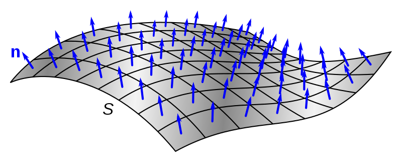.imgref[[[wiki]](https://www.wikiwand.com/en/Normal_(geometry)]]

---
.header[Implicit Surfaces]

## Normals

But we have...

.center[]

---
.header[Implicit Surfaces]

## Normals

For computing the normal $n$ at a point $p$ on a implicit surface, we can use the ***gradient*** of the signed distance function at that point.  


???
.task[COMMENT:]  

* What is the gradient?

---
.header[Implicit Surfaces | Normals]

## Gradient Vector

The gradient vector can be interpreted as the *direction and rate of the fastest increase* of a function.

--

.center[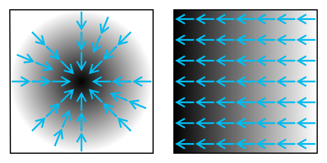]

.footnote[[[Wiki]](https://www.wikiwand.com/en/Gradient)]


???
.task[COMMENT:]  

* If the gradient of a function is non-zero at a point p, the direction of the gradient is the direction in which the function increases most quickly from p, and the magnitude of the gradient is the rate of increase in that direction, the greatest absolute directional derivative.


???
.task[COMMENT:]  

For 2D functions the gradient is a 2D vector, and for 3D functions it is a 3D vector.   

---
.header[Implicit Surfaces | Normals]

## Gradient Vector

> Roughly speaking, the gradient is to 2D or 3D functions what the derivative is to a 1D function. For 2D functions the gradient is a 2D vector, and for 3D functions it is a 3D vector.   

--

* For function f(x) you would speak of the *derivative*
* For functions f(x,y) or f(x,y,z), you would speak of the *gradient*

???
.task[COMMENT:]  

* Mathematically the concept of gradient is not limited to 2D or 3D functions but in computer graphics, these are the cases that are the most relevant. 
* To be more specific, let's say that if you had a function f(x) you would speak of derivative, but if you had a function f(x,y) or f(x,y,z), you would speak of gradient. If the latter case, we say that that we have a function of several variables.

---
.header[Implicit Surfaces]

## Normals

It can be mathematically proven that the gradient of a differentiable implicit function $f(x,y,z)= c$ is always perpendicular to the iso-surfaces described by $c$.  


???
.task[COMMENT:]  

* Or isolines in 2D

--

Hence, the gradient of $f(x,y,z)= c$ at a point lying on the surface gives you the normal at that point!

--

$n = normalize(\nabla f(p))$


.footnote[[[Wiki](https://www.wikiwand.com/en/Gradient), [Inigo Quilez](https://www.iquilezles.org/www/articles/normalsSDF/normalsSDF.htm)]]

???
.task[COMMENT:]  

* The nabla symbol, written as an upside-down triangle and pronounced "del", can be understood as gradient
* It denotes actually the partial derivatives of f at point p.
    * Differentiation with respect to x, holding y and z constant 
    * Same for y and z
    * Then adding the derivatives up


---
.header[Implicit Surfaces]

## Normals

.left-even[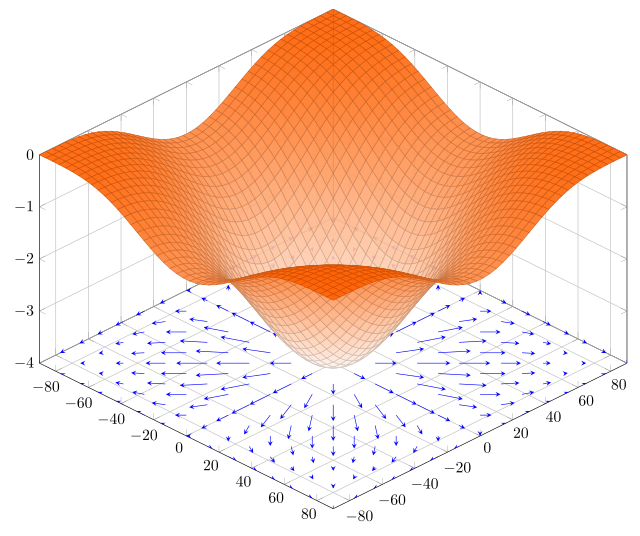]
.right-even[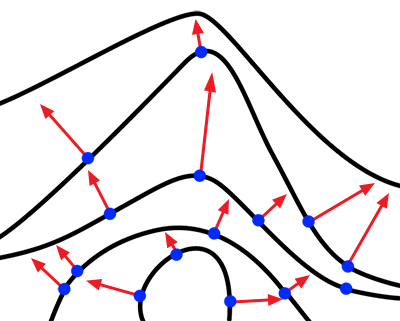]

.footnote[[[Wiki](https://www.wikiwand.com/en/Gradient), [Scratchapixel](https://www.scratchapixel.com/lessons/advanced-rendering/rendering-distance-fields/basic-sphere-tracer)]]


???
.task[COMMENT:]  

* Imagine the right figure as a vertical slice in function left whose values over space are given by an implicit function f(x,y,z)= c. 
* The iso-surfaces right show what the density fields looks like for five different values of c. 
* As can you see the gradients vectors are pointing out in the direction of greatest rate of change and their magnitude is also proportional to this rate (a larger gap between two adjacent lines indicates a greater rate of change). You can also visually check that these gradient vectors are perpendicular to the tangents to the curves

---
.header[Implicit Surfaces]

## Normals

There are multiple ways to compute such a gradient, all with different advantages and disadvantages

--
* Numerical approximations
* Analytical


???
.task[COMMENT:]  
Some are numerical, others are analytical, all with different advantages and disadvantages.

--
A favorite due to its simplicity

* Using **central differences** based on the **partial derivatives** of a function

???
.task[COMMENT:]  
The most common one in the context of computing normals for an implicit surface is the approach of using **central differences** based on the **partial derivatives** of a function.

.footnote[[[Wiki](https://www.wikiwand.com/en/Gradient), [Inigo Quilez](https://www.iquilezles.org/www/articles/normalsSDF/normalsSDF.htm)]]

--

It is neither the fastest nor the most accurate.


???
.task[COMMENT:]  

*  It might not be the fastest or most accurate. Still, its simplicity make it the most popular way to compute normals in realtime ray-marched or sphere traced demos and games.

---
.header[Implicit Surfaces | Normals]

## Central Differencing

.left-even[
You can compute the derivative of $f(x)$ with $h$ approaching $0$ as
  

$\lim_{h \to 0} = \dfrac{f(x+h) - f(x-h)}{2h}.$  
  
The result gives us the slope of the tangent at P along the x-axis.
]

.right-even[
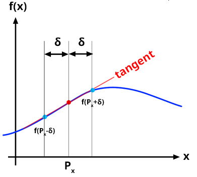
]


.footnote[[[scratchapixel]](https://www.scratchapixel.com/lessons/advanced-rendering/rendering-distance-fields/basic-sphere-tracer)]

???
.task[COMMENT:]  

* Now we would like to compute the rate of change of that function at a given point P in space. How we do that? The solution is simple: you compute the gradient by essentially decomposing this problem into simpler ones. 
* The idea is to take a small step towards the left of P and evaluate the function there, then do the same thing to the right, subtract the two numbers and normalize (which is done by dividing the finite difference by h=(a+b).
* If we repeat the process for the other two axes, then we get three numbers which as you maybe guess, put together form a three-dimensional vectors.

---
.header[Implicit Surfaces]

## Normals

The complete gradient is now computed by taking such partial derivative of the function $f(x,y,z)$ on each axis $\vec i = (1,0,0), \vec j =(0,1,0), \vec k =(0,0,1)$.

--

We then combine the results to form the three-dimensional gradient vector.  

---
.header[Implicit Surfaces]

## Normals

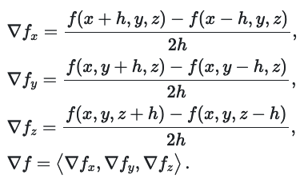

.footnote[[[scratchapixel]](https://www.scratchapixel.com/lessons/advanced-rendering/rendering-distance-fields/basic-sphere-tracer)]

--

The x-, y- and z-coordinate of that vector indicates the rate-of-change of the function $f$ along the x-, y- and z-axis respectively.

---
.header[Sphere Tracing]

## Normals

For the implementation we can discard the normalization with the division by 2h as we rescale the normal anyways to unit length. Hence we do not need to take care of the proper magnitude of the vector.

--

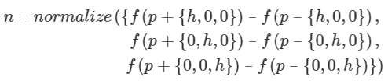

--

For h we set some small value, e.g. 0.0001 and call it EPSILON.

---
.header[Sphere Tracing]

## Normals

```glsl
#define EPSILON 0.0001
```

--

```glsl
vec3 estimateNormal(vec3 p) // p is point_on_surface
{
    vec3 n = vec3(
        sdfScene(vec3(p.x + EPSILON, p.y, p.z)) 
                        - sdfScene(vec3(p.x - EPSILON, p.y, p.z)),
        sdfScene(vec3(p.x, p.y + EPSILON, p.z)) 
                        - sdfScene(vec3(p.x, p.y - EPSILON, p.z)),
        sdfScene(vec3(p.x, p.y, p.z  + EPSILON)) 
                        - sdfScene(vec3(p.x, p.y, p.z - EPSILON))
    );

    return normalize(n);
}
```

.footnote[[[Inigo Quilez](https://www.iquilezles.org/www/articles/normalsSDF/normalsSDF.htm)]]


---
.header[Sphere Tracing]

## Normals

We can do this a bit more elegantly... with swiffeling!

```glsl
vec3 estimateNormal(vec3 p) // p is point_on_surface
{
    const vec2 h = vec2(EPSILON,0);
    vec3 n = vec3(sdfScene(p + h.xyy) - sdfScene(p - h.xyy),
                  sdfScene(p + h.yxy) - sdfScene(p - h.yxy),
                  sdfScene(p + h.yyx) - sdfScene(p - h.yyx));

    return normalize(n);
}

```


---
.header[Sphere Tracing]

## Simple Shading

Now that we have the normals, and with that can compute how a surface is e.g. oriented towards the light, we can do some basic shading.

---
.header[Sphere Tracing]

## Simple Shading

.center[]

.footnote[[[based on: scratchapixel]](https://www.scratchapixel.com/lessons/3d-basic-rendering/rendering-3d-scene-overview/3d-rendering-overview)]

--

> We need to know how our surface point reflects the incoming light, to know which light reaches the eye.


---
.header[Sphere Tracing | Simple Shading]

## How Much Light Reaches The Camera?

.center[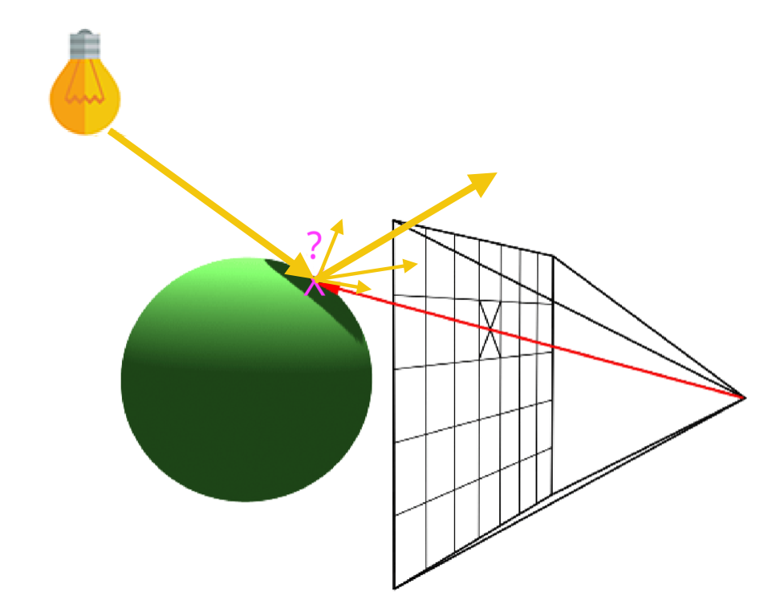]

---
.header[Sphere Tracing | Simple Shading]

### How Much Do We Need To Adjust The Brightness?

.center[]


---
.header[Sphere Tracing]

## Simple Shading


As reflection behavior we are going to do a ***diffuse shading***, also called *lambert* shading.


---
template: inverse

# Diffuse Shading

---

## Diffuse Reflection

???
.task[COMMENT:]  

* What is a diffuse reflection?

--

A diffuse reflection looks the same under all observation directions. 

--

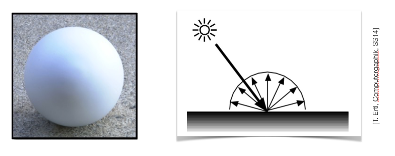

--

It only depends on the light direction.

---

## Diffuse Reflection

In comparison a shiny reflection:

.center[]

--

We will come back to this in the Materials & Shading workshop!

---

## Diffuse Reflection

A diffuse reflection looks the same under all observation directions. 


**It only depends on the light direction.**


---
.header[Diffuse Reflection]

## Light Direction

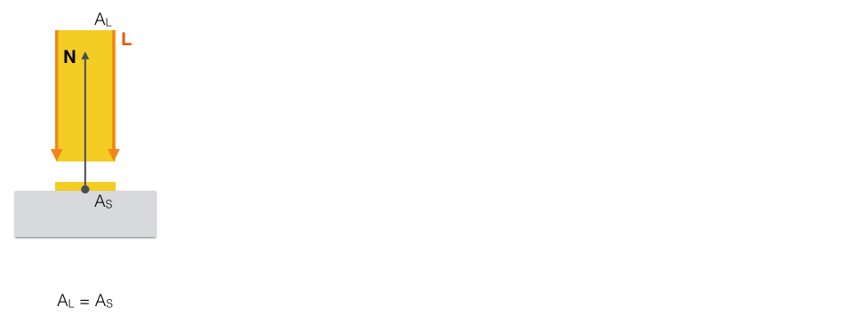

---
.header[Diffuse Reflection]

## Light Direction

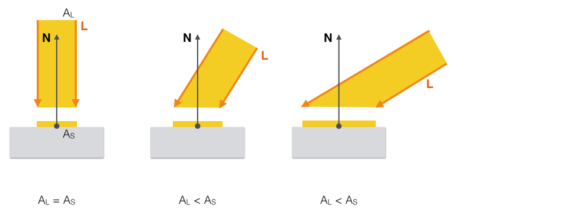

---
.header[Diffuse Reflection]

## Light Direction


As the angle between the normal vector and the light direction increases, the surface area illuminated by the beam of light (which stays the same) increases...

--


... and the intensity of the light per unit surface area **decreases**.

---
.header[Diffuse Reflection]

## Light Direction


This means that depending on the angle between light and normal, we want to multiply the light intensity with a factor.

--

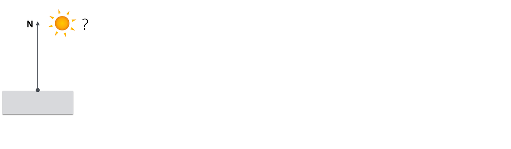

---
.header[Diffuse Reflection]

## Light Direction


This means that depending on the angle between light and normal, we want to multiply the light intensity with a factor.


---
.header[Diffuse Reflection]

## Light Direction


This means that depending on the angle between light and normal, we want to multiply the light intensity with a factor.

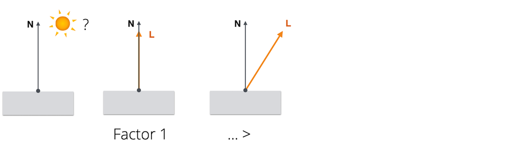

---
.header[Diffuse Reflection]

## Light Direction


This means that depending on the angle between light and normal, we want to multiply the light intensity with a factor.


---
.header[Diffuse Reflection]

## Light Direction


This means that depending on the angle between light and normal, we want to multiply the light intensity with a factor.


---
.header[Diffuse Reflection]

## Light Direction


This means that depending on the angle between light and normal, we want to multiply the light intensity with a factor.


> Cosine to the rescue!


---
.header[Diffuse Reflection]

## Cosine to the rescue!

${cosθ}$: 

.center[]

---
.header[Diffuse Reflection]

## Cosine to the rescue!

${cosθ}$: 

.center[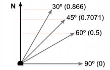]


.footnote[[[Unity Manual]](https://docs.unity3d.com/Manual/UnderstandingVectorArithmetic.html)]


---
.header[Diffuse Reflection | Light Direction]

## Lambert's Cosine Law

We need to decrease in the intensity of the light by a factor of ${cosθ}$
  
--
.center[]


---
.header[Diffuse Reflection | Light Direction]

## Lambert's Cosine Law

The value of ${cosθ}$ is given by the **dot product** between the normal vector $N$ and the unit direction to the light source $L$. 
  
<br/>
${cosθ} = L ∙ N$

--

> Don't forget to normalize L and N!

---
.header[Diffuse Reflection | Light Direction]

## Lambert's Cosine Law

.left-even[
> What about the light facing in the opposite direction of the surface normal?
]
--

.right-even[]  


???
.task[COMMENT:]  

* What should the factor be? -> 0


---
.header[Diffuse Reflection | Light Direction]

## Lambert's Cosine Law

.left-even[
> What about the light facing in the opposite direction of the surface normal?
  

The factor should be zero...
]

.right-even[]  


???
.task[COMMENT:]  

* and should not be illuminated at all. 


---
.header[Diffuse Reflection | Light Direction]

## Lambert's Cosine Law

.left-even[
> What about the light facing in the opposite direction of the surface normal?
  

The factor should be zero and should not be illuminated at all. 
]

.right-even[]  


???
.task[COMMENT:]  

* and should not be illuminated at all. 


---
.header[Diffuse Reflection | Light Direction]

## Lambert's Cosine Law


.right-even[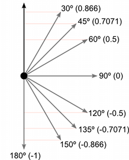]

.footnote[[[Unity Manual]](https://docs.unity3d.com/Manual/UnderstandingVectorArithmetic.html)]


---
.header[Diffuse Reflection | Light Direction]

## Lambert's Cosine Law

.left-even[
Lucky Us! 

The dot product becomes negative when the surface is facing away from the light source.
]

.right-even[]  

.footnote[[[Unity Manual]](https://docs.unity3d.com/Manual/UnderstandingVectorArithmetic.html)]


???
.task[COMMENT:]  
 
  
* ANy ideas how to do this algorithmically? What to do with cosinus?

---
.header[Diffuse Reflection | Light Direction]

## Lambert's Cosine Law

Hence, we can clamp the dot product to zero for our illumination calculations:
  
$max(L ∙ N, 0)$

--

.center[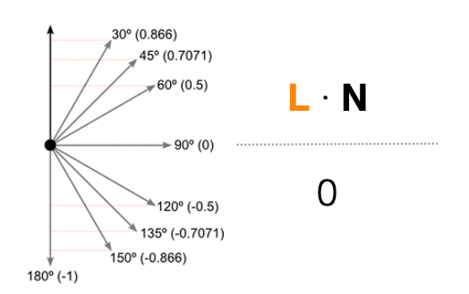]

---
.header[Diffuse Reflection | Light Direction]

## Lambert's Cosine Law

$max(L ∙ N, 0)$

This is  *Lambertian reflection*.

--

Meaning this is the factor with which we need to multiply the incoming light.

--

```glsl
float reflection_diffuse = max(dot(light_direction_to_point, surface_normal), 0.);
```

---
## Simple Shading

*And now what?*

--

Well, we have the reflection behavior of the surface ✓

--

We still need the light itself...

---
.header[Simple Shading]

## Light

```glsl
// The Light
// Light position
vec3 light_position = vec3(2, 8, 0);

// Light direction
vec3 light_direction_to_point = normalize(light_position - point_on_surface);
```

--

.center[]

---
.header[Simple Shading]

## Light

For simplicity, we are assuming a light intensity of (1, 1, 1).

---
.header[Simple Shading]

## Diffuse Shading

```glsl
// The Light
// Light position
vec3 light_position = vec3(2, 8, 0);

// Light direction
vec3 light_direction_to_point = normalize(light_position - point_on_surface);
```

--

```glsl
// Normal of the surface
vec3 surface_normal = estimateNormal(point_on_surface);

// The reflection behavior
vec3 color_material = vec3(0.8, 0.8, 0.8);
float reflection_diffuse = max(dot(light_direction_to_point, surface_normal), 0.);

return color_material * reflection_diffuse;
```

---
.header[Simple Shading]

## Ambient Light

--

For simple shading we usually add a constant color to mimic ambient light.

```glsl
vec3 color_ambient = vec3(0.06, 0.1, 0.2);
```

---
.header[Simple Shading]

## Ambient Light

```glsl
// Normal of the surface
vec3 surface_normal = estimateNormal(point_on_surface);

// The reflection behavior
vec3 color_material = vec3(0.8, 0.8, 0.8);
float reflection_diffuse = max(dot(surface_normal, light_direction_to_point), 0.);

// A bit of additional ambient to lighten up everything
vec3 color_ambient = vec3(0.06, 0.1, 0.2);

return color_material * reflection_diffuse + color_ambient;
```

---
.header[Simple Shading]

## Shadows

???
.task[COMMENT:]  

* Ideas?

--

We need to check if there is an object between the point we are shading and the light. If there is, the surface point is in the shadow!

---
.header[Simple Shading]

## Shadows

.center[.imgref[[[scratchapixel]](https://www.scratchapixel.com/lessons/3d-basic-rendering/introduction-to-ray-tracing/implementing-the-raytracing-algorithm)]]

---
.header[Simple Shading]

## Shadows

.center[.imgref[[[scratchapixel]](https://www.scratchapixel.com/lessons/3d-basic-rendering/introduction-to-ray-tracing/implementing-the-raytracing-algorithm)]]


---
.header[Simple Shading]

## Shadows

1. Compute the distance from the point to the light

--
2. Compute the distance from the point to the scene surfaces along the point-light-ray

--

> If the distance to the scene is smaller than the distance to the light then there is an object between surface point and light, and we need to add shadow to the shading of the point.

---
.header[Simple Shading]

## Shadows

```glsl
#define MOVE_POINT .02

vec3 point_moved_up = vec3 (point_on_surface + surface_normal * MOVE_POINT);
float distance_to_scene_light_direction = 
                        sphereTracing(point_moved_up, light_direction_to_point);
```
--
```glsl
float shading_shadow = 1.;
if(distance_to_scene_light_direction < length(light_position-point_on_surface)) 
{
    shading_shadow *= .1;
}
```

--

The complete shading:

```glsl
return vec3((color_material * reflection_diffuse * shading_shadow) + color_ambient);
```

---
template:inverse

# ✨ 
#### The End


---
template:inverse

## Hands On!
# 🧑🏻‍💻

---
## Exercise

1. Follow the steps in [spheretracing_03_diffuse_shading_steps.md](../02_code/fragmentshader/spheretracing_02_diffuse_shading_steps.md) to implement diffuse shading in the scene.
2. Explore!

