name: inverse
layout: true
class: center, middle, inverse
---


# Shader Programming Workshop

#### Prof. Dr. Lena Gieseke | l.gieseke@filmuniversitaet.de  
#### Film University Babelsberg KONRAD WOLF

<br >

## *Scene Building*


<!--
Start server in /doc/

h or ?: Toggle the help window
j: Jump to next slide
k: Jump to previous slide
b: Toggle blackout mode
m: Toggle mirrored mode.
c: Create a clone presentation on a new window
p: Toggle PresenterMode
f: Toggle Fullscreen
t: Reset presentation timer
<number> + <Return>: Jump to slide <number>
-->

---
layout: false

## Topics

* Transformations
* Constructive Solid Geometry
* Example Repetition 
* Gamma Correction
* Anti-Aliasing

---
## 3D Scene

> How to add more objects and place them in the scene?


---
.header[3D Scene]

## 3D Scene

```glsl
float sdfRectangle(vec3 p, vec3 size)
{
    vec3 d = abs(p) - size;
    return length(max(d,0.0)) + min(max(d.x, max(d.y, d.z)),0.0);
}
```

--

For more shapes, please refer to Inigo Quilez's excellent [overview of distance functions](https://iquilezles.org/www/articles/distfunctions/distfunctions.htm).


---
template:inverse

# Transformations


???
.task[COMMENT:]  

* Let's say we want to add a second sphere...

---
## Transformations

How to transform a sphere or geometry in general in 

* Location 
* Orientation 
* Scale

--

Well, we don't... 😁

---
## Transformations

Moving objects is hard,

--
moving our camera is easy!  

--

> Instead of applying a transformation to all relevant parts of the equation for a shape, we can simply move our view vector and with that our camera around.

---
## Transformations

Let's say we want to move up a sphere:

--

.center[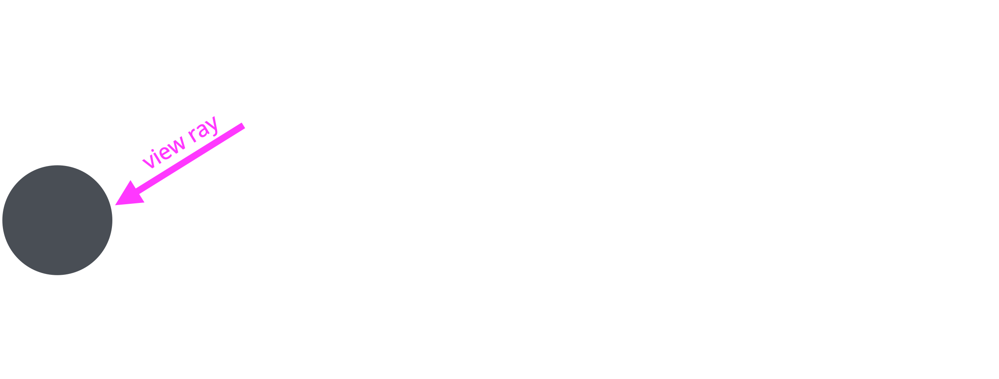]

---
## Transformations

Let's say we want to move up a sphere:

.center[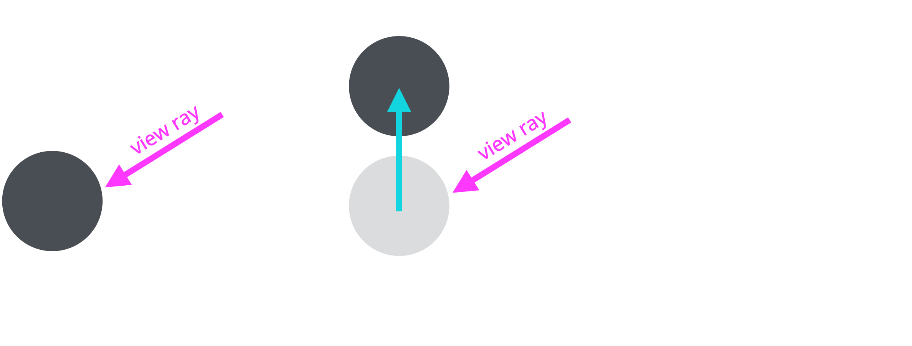]

---
## Transformations

Let's say we want to move up a sphere:

.center[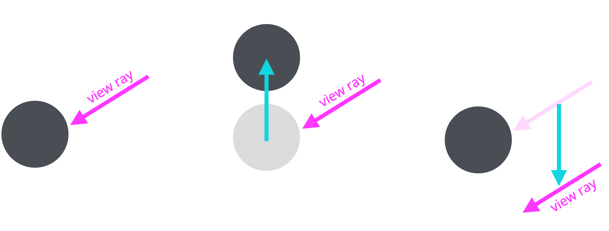]

---
## Transformations

Within the sphere tracing algorithm, we need to move the point on the ray we are currently evaluating the scene for:

--

.center[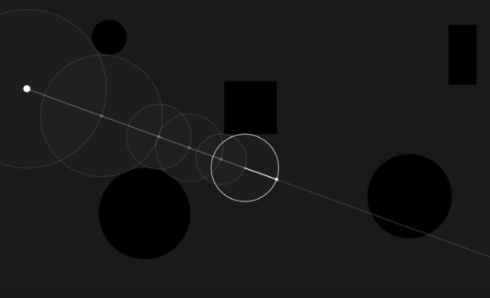]

---
## Transformations

.center[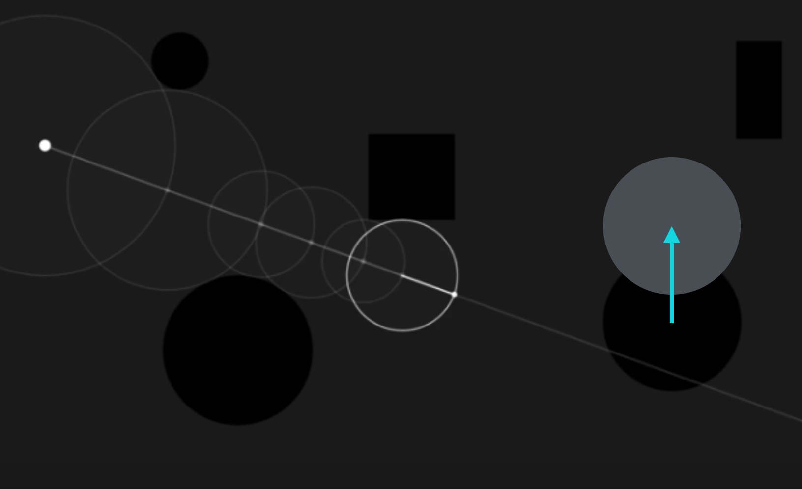]

---
## Transformations

.center[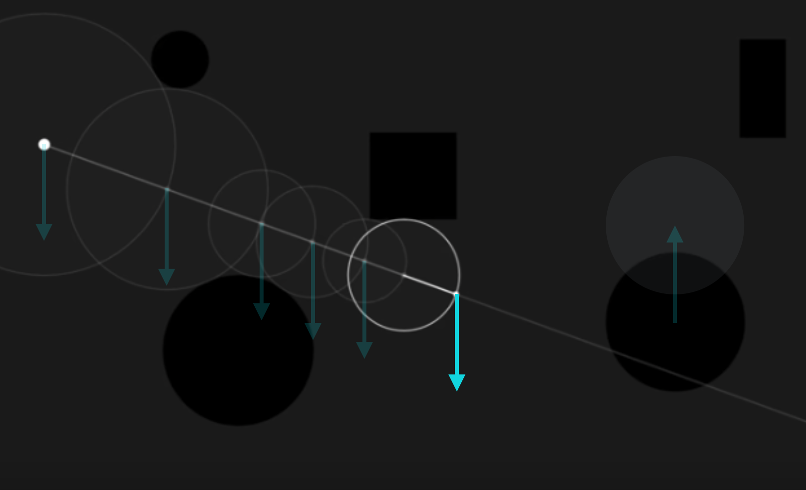]


---
## Transformations

.center[]


--

> Instead of applying transformation matrix T to a shape,  

???
.task[COMMENT:]  

* More formally we can say:  
  
--
  
> we apply $T^{-1}$ to the point on ray before evaluating the SDF of the shape.


???
.task[COMMENT:]  

* Keep in mind that the inverse of an orthogonal matrix is the matrix transpose. 

---
## Transformations

There are two types of transformations. Transforms that

--
* preserve distances (isometric)

--
* distort the original ratios (non-isometric)

--

Rotation and translation are isometric, scale is non-isometric.

???
.task[COMMENT:]  

* Can you think of an example?


---
.header[Transformations]
## Isometric vs. Non-Isometric Transformations

.left-even[
Points: $(3,3,3)$ and $(0,0,0)$  

]


---
.header[Transformations]
## Isometric vs. Non-Isometric Transformations

.left-even[
Points: $(3,3,3)$ and $(0,0,0)$  

* Distance $d = 5.196152$

]


---
.header[Transformations]
## Isometric vs. Non-Isometric Transformations

.left-even[
Points: $(3,3,3)$ and $(0,0,0)$  

* Distance $d = 5.196152$

Translate with $(2,2,2)$:
* $(3,3,3) \rightarrow (5,5,5)$
* $(0,0,0) \rightarrow (2,2,2)$
* Distance $d = 5.196152$
]

???
.task[COMMENT:]  


When we translate them with (2,2,2), we get (5,5,5) and (2,2,2) and with that preserved distances.  

--

.right-even[
Scale with $(2,2,2)$:
* $(3,3,3) \rightarrow (6,6,6)$
* $(0,0,0) \rightarrow (0,0,0)$
* Distance: $d = 10.392305$
]


???
.task[COMMENT:]  

* When we scale them with 2, we get (6,6,6) and (0,0,0) and with that the distance between the points changed.  
* With that distances between a point on the ray and points on the surface of the objects making up the scene don't compare anymore.

---
.header[Transformations]
## Isometric vs. Non-Isometric Transformations

.left-even[
Points: $(3,3,3)$ and $(0,0,0)$  

* Distance $d = 5.196152$

Translate with $(2,2,2)$:
* $(3,3,3) \rightarrow (5,5,5)$
* $(0,0,0) \rightarrow (2,2,2)$
* Distance $d = 5.196152$
]


.right-even[
Scale with $(2,2,2)$:
* $(3,3,3) \rightarrow (6,6,6)$
* $(0,0,0) \rightarrow (0,0,0)$
* Distance: $d = 10.392305$

Distances between a point on the ray and surface points don't compare anymore.
]


???
.task[COMMENT:]  

* https://www.calculatorsoup.com/calculators/geometry-solids/distance-two-points.php
* 

---
.header[Transformations]
## Isometric vs. Non-Isometric Transformations

One possible solution:

* Separate transformations
* Isometric vs. non-isometric  

--

This means you can not apply a 4x4 transformation matrix for translation, rotation and scale at the same time.


???
.task[COMMENT:]  


We apply translation as a vector and rotation as a 3x3 matrix or as Euler angles.


---
.header[Transformations]

## Translation

```glsl
// Translation
sdf(p - offset)
```

--

E.g. for our sphere

```glsl
distance_to_scene = sdfSphere(point_on_ray - vec3(2, 2, 2), radius);
```


---
.header[Transformations]

## Rotation

```glsl
// Rotation matrix around the X
mat3 rotateX(float theta) 
{
    float c = cos(theta);
    float s = sin(theta);
    return mat3(
        vec3(1, 0, 0),
        vec3(0, c, -s),
        vec3(0, s, c)
    );
}
```

```glsl
// Rotate X
sdfSphere(p.rotateX(-theta))
```


???
.task[COMMENT:]  

```glsl
// Rotate Y
sdf(p.rotY(-theta))
```

```glsl
// Rotate Z
sdf(p.rotZ(-theta))
```


* https://en.wikipedia.org/wiki/Rotation_matrix
* spheretraching_08_transformations.frag
    * Show rotation build up (without parentheses)

---
.header[Transformations]

## Scaling

1. Apply $S^{-1}$ to current point on the view ray


???
.task[COMMENT:]  
For scale, we will also apply the inverse of the scale $S^{-1}$ to the current point on the view ray.

--
2. Compute distances (in object space)


???
.task[COMMENT:]  
But then once you have computed the distance (in object space), you will need to scale that distance back by the scale value S (to world space).

--
3. Convert distance to world space by applying $S$ 

--

```glsl
// Scale
float dist = sdf(p / scale)     // apply inverse scale S^-1 
return dist * scale;            // apply scale again to preserve distances
```
--
  
```glsl
// In short
sdf(p / scale) * scale;
```
--

For now, we are only dealing with uniform scaling.
  

---
.header[Transformations]

## Scaling

Points: $(3,3,3)$ and $(0,0,0)$, Distance $d = 5.196152$

--

Scale by 2 ($S$):

--
* Hence a division by 2 ($S^{-1}$)

--
* Points: $(1.5, 1.5, 1.5)$ and $(0,0,0)$  

--
* Distance $d = 2.598076$
  
--
  
Apply $S$ to distance, meaning multiply it by 2:

--
* Distance $d = 2.598076 * 2 = 5.196152$
  
--
  
Applying $S$ brings us back to world space distance, which we can use to march on the ray.

---
template:inverse

# Constructive Solid Geometry


---
## Constructive Solid Geometry

* Mathematically combine and manipulate implicit surfaces


???
.task[COMMENT:]  

As already discussed for 2D shapes, we can mathematically combine and manipulate implicit surfaces in all sort of ways to create shapes.

--

> Assembling shapes to create more complex shapes in 3D is called *constructive solid geometry* or CSG. 


???
.task[COMMENT:]  

* These operations would be extremely hard to produce with more traditional modeling methods (especially polygons).
* CSG is a typical method of what we call *procedural modelling*.  
* We don't model shapes by moving vertices by hand, but by combining simple shapes using mathematics and automated processes.

--
* Some of the effects would be hard to produce with polygonal modeling!

---
## Constructive Solid Geometry

The most basic assembly methods are with *boolean operators*.

--

In the following a quick reminder... (we have done this before).

.footnote[[[scratchapixel]](https://www.scratchapixel.com/lessons/advanced-rendering/rendering-distance-fields/constructive-solid-geometry-blends-deformers)]

---
.header[Constructive Solid Geometry | Boolean Operators]

## Union

Return the minimum distance to the two surfaces you wish to combine:

.center[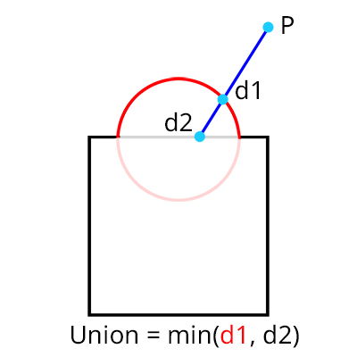]

.footnote[[[scratchapixel]](https://www.scratchapixel.com/lessons/advanced-rendering/rendering-distance-fields/constructive-solid-geometry-blends-deformers)]

This is how we have assembled our scene so far.


???
.task[COMMENT:]  

One of the most basic operations is to add two objects together something that is best described in mathematics with the union operator. You can achieve this effect by just returning the minimum distance to the two objects you wish to combine as shown in figure 1.

---
.header[Constructive Solid Geometry]

## Smooth Minimum


This allows shapes to blend together as they get near each other.


???
.task[COMMENT:]  

* Essentially this allows you to take the union of two objects, and smooth out the intersection point.  

--

The gravity of the "blending" can be adjusted by the variable k in the function below:

```glsl
...
    // Smooth Minimum
    float k = 0.2;
    d = smin(circle1, circle2, k);
...
```


???
.task[COMMENT:]  

* spheretracing_09_csg.frag


---
.header[Constructive Solid Geometry | Boolean Operators]

## Subtraction

.left-even[
1. Invert the sign of the sdf of the first shape
2. Take the maximum of the two shapes' distances

.footnote[[[scratchapixel]](https://www.scratchapixel.com/lessons/advanced-rendering/rendering-distance-fields/constructive-solid-geometry-blends-deformers)]
]


.right-even[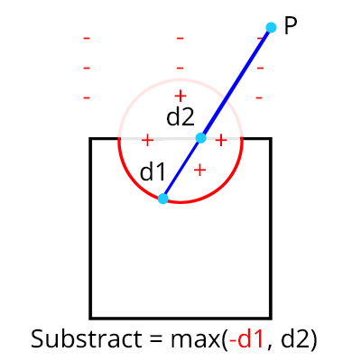]


???
.task[COMMENT:]  

*  To do so, you first need to invert the sign of the distance estimator of the first shape. If you look at figure 2, you can see that the inside of the sphere now returns positive signed distance to the surface, and any point outside of the sphere will return a negative signed distance. Then take the maximum of the two distances. With this effect, you can create a hole in the second object that has the shape of the first object.
* spheretracing_09_csg.frag
  
---
.header[Constructive Solid Geometry | Boolean Operators]

## Intersection

.left-even[
Return the largest distance:

.footnote[[[scratchapixel]](https://www.scratchapixel.com/lessons/advanced-rendering/rendering-distance-fields/constructive-solid-geometry-blends-deformers)]
]

.right-even[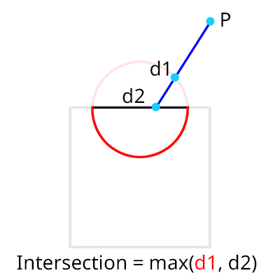]


???
.task[COMMENT:]  

* spheretracing_09_csg.frag


---

## Constructive Solid Geometry

You can use pretty much any mathematical function you want on working with signed distance functions!


???
.task[COMMENT:]  

* ...in order to create all sort of pretty cool effects. So literally anything you can imagine from using a cosine, an exponential function, or a modulo operator can be used ...
* Also, you are not limited to two objects. 

--

You are not limited to two objects.

???
.task[COMMENT:]  

* You can for example compute the intersection of two objects and combine the resulting shape with a third object, etc.


---
.header[Constructive Solid Geometry]

## CSG Trees


.left-quarter[
* $\cap$ for intersection  
* $\cup$ for union  
* \ for difference

.footnote[[[kindpng]](https://www.kindpng.com/imgv/TbTmTmT_images-csg-tree-constructive-solid-geometry-png-transparent/)]
]

.right-quarter[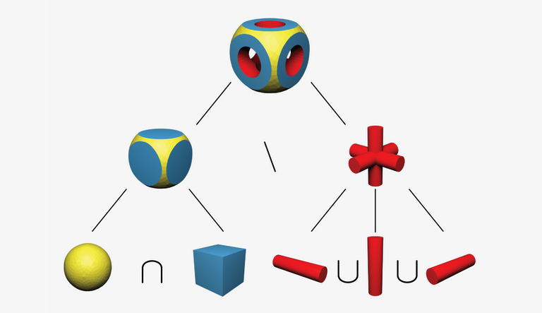]


???
.task[COMMENT:]  

* People working on solid geometry, call this a CSG tree. Computing or evaluating these trees efficiently is a topic of research.
* spheretracing_09_csg.frag

---
.header[Constructive Solid Geometry]

## CSG Trees

.center[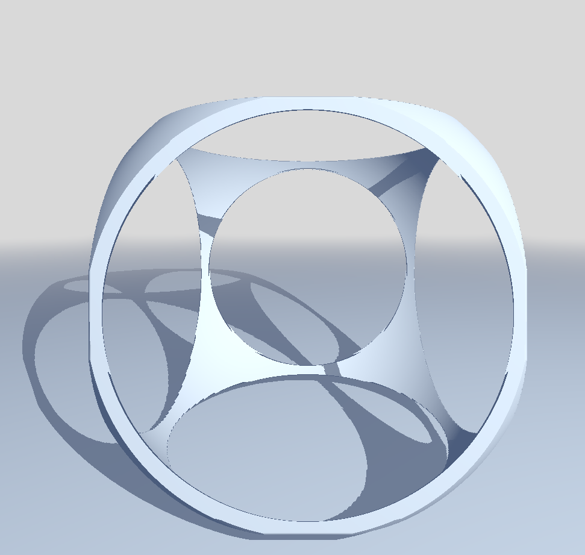]

---
.header[Constructive Solid Geometry]

## CSG Trees


.center[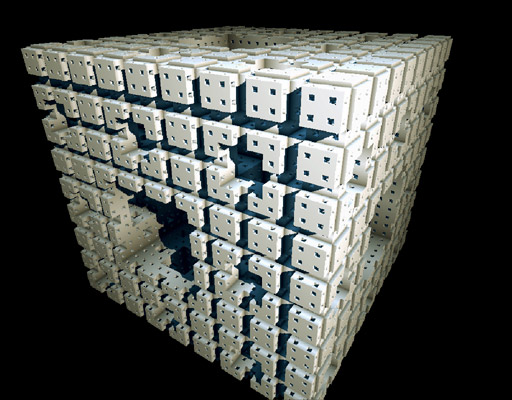  
[[Inigo Quilez - Menger Fractal]](https://iquilezles.org/articles/menger/)]  

---
.header[Constructive Solid Geometry]

## CSG Trees


.center[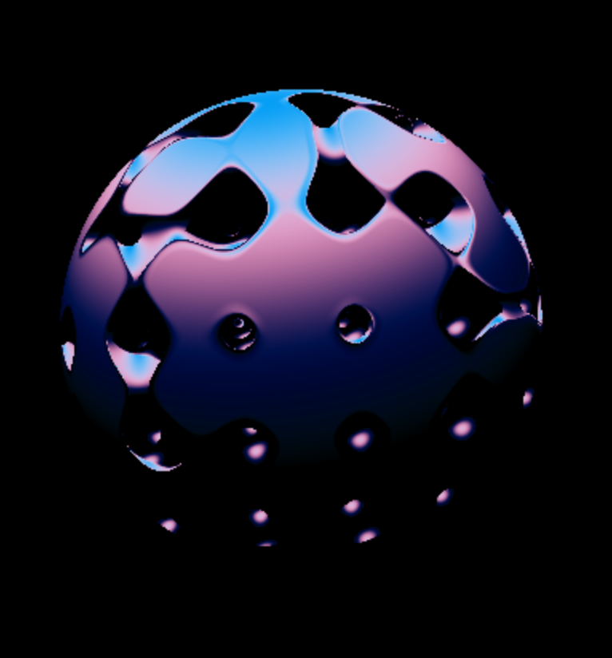  
[[Painting with Math: A Gentle Study of Raymarching]](https://blog.maximeheckel.com/posts/painting-with-math-a-gentle-study-of-raymarching/)]  


---
## Further Effects

--

.left-even[
With *function design* we can obtain various effects:
]

---
## Further Effects


.left-even[
With *function design* we can obtain various effects:

* Infinite repetition

]

???
.task[COMMENT:]  

* Repetition Example -> Follow, open diffuse shading example


---
## Further Effects


.left-even[
With *function design* we can obtain various effects:

* Infinite repetition
* Bending ([1](https://www.shadertoy.com/view/Wlt3DM), [2](https://www.shadertoy.com/view/3llfRl), [3](https://www.shadertoy.com/view/WldGWM), [4](https://www.shadertoy.com/view/WltcRH))
]


---
## Further Effects

.left-even[
With *function design* we can obtain various effects:

* Infinite repetition
* Bending ([1](https://www.shadertoy.com/view/Wlt3DM), [2](https://www.shadertoy.com/view/3llfRl), [3](https://www.shadertoy.com/view/WldGWM), [4](https://www.shadertoy.com/view/WltcRH))
* Displacements ([1](https://www.shadertoy.com/view/MstXWS), [2](https://www.shadertoy.com/view/Ws3XWl))
]

---
## Further Effects

.left-even[
With *function design* we can obtain various effects:

* Infinite repetition
* Bending ([1](https://www.shadertoy.com/view/Wlt3DM), [2](https://www.shadertoy.com/view/3llfRl), [3](https://www.shadertoy.com/view/WldGWM), [4](https://www.shadertoy.com/view/WltcRH))
* Displacements ([1](https://www.shadertoy.com/view/MstXWS), [2](https://www.shadertoy.com/view/Ws3XWl))
* Morphing / Interpolation ([1](https://www.shadertoy.com/view/3sycDm), [2](https://www.shadertoy.com/view/MslSDN))
]

---
## Further Effects

.left-even[
With *function design* we can obtain various effects:

* Infinite repetition
* Bending ([1](https://www.shadertoy.com/view/Wlt3DM), [2](https://www.shadertoy.com/view/3llfRl), [3](https://www.shadertoy.com/view/WldGWM), [4](https://www.shadertoy.com/view/WltcRH))
* Displacements([1](https://www.shadertoy.com/view/MstXWS), [2](https://www.shadertoy.com/view/Ws3XWl))
* Morphing / Interpolation ([1](https://www.shadertoy.com/view/3sycDm), [2](https://www.shadertoy.com/view/MslSDN))
* Twists ([1](https://www.shadertoy.com/view/MlcGRf), [2](https://www.shadertoy.com/view/4tc3WB), [3](https://www.shadertoy.com/view/4ts3WN), [4](https://www.shadertoy.com/view/4dX3Rn), [5](https://www.shadertoy.com/view/4lGyW1))
]

.right-even[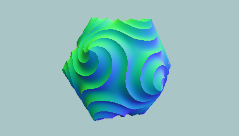  .imgref[[[tdhooper]](https://www.shadertoy.com/view/Mtc3RX)]]

---
template:inverse

### Further Effects

# Repetition

---
.header[Further Effects]

## Repetition Example

* Start with your last version or with file `spheretracing_03_diffuse_shading.frag`
* The code to be added can be found in `scenesetup_03_repetition_steps.md`


---
.header[Further Effects]

## Repetition Example


```glsl
// Repetition
point_on_ray = fract(point_on_ray) - .5;
distance_to_scene = sdfSphere(point_on_ray, 0.15);
```

* `fract()`: iterate over 0..1
* `- 0.5`: center range at the origin in the middle of the screen


???
.task[COMMENT:]  

* 
* Start with the last scene
* Also show `mod`

```glsl
    float loop_max = 3.;
    point_on_ray = mod(point_on_ray, loop_max);
    point_on_ray -= (0.5 * loop_max);
```

* Control iterations with MAX_DISTANCE

---
.header[Further Effects | Repetition Example]

## Fog 

When far away from the camera, mix in (or better switch to) a fog color.

--

Mixing in a color:

```glsl
color = mix(color, vec3(0.8), fog); 
```

???
.task[COMMENT:]  

* What does mix do?

--

`vec3 mix(vec3 x, vec3 y, vec3 a)`


`mix()` performs a linear interpolation between `x` and `y` using `a` to weight between them. The return value is computed as $x (1−a) + ya$.

.footnote[[[The Book of Shaders]](https://thebookofshaders.com/glossary/?search=mix)]

---
.header[Further Effects | Repetition Example]

## Fog 

What as fog factor?

--

A fog factor based on a distance to the camera:

```glsl
#define FAR 30.
...
float fog = smoothstep(0., .95, distance_to_scene/FAR);
```
The fog factor 
* Ranges between `0..1`
* Increases with `distance_to_scene` and becomes 1 once `distance_to_scene >= FAR`
* Becomes faster 1, the smaller the second argument (`0.95`)


???
.task[COMMENT:]  

* The smoothstep function returns 0.0 if x is smaller than edge0 and 1.0 if x is larger than edge1. Otherwise the return value is interpolated between 0.0 and 1.0

https://registry.khronos.org/OpenGL-Refpages/gl4/html/smoothstep.xhtml
smoothstep performs smooth Hermite interpolation between 0 and 1 when edge0 < x < edge1. This is useful in cases where a threshold function with a smooth transition is desired. smoothstep is equivalent to:

    genType t;  /* Or genDType t; */
    t = clamp((x - edge0) / (edge1 - edge0), 0.0, 1.0);
    return t * t * (3.0 - 2.0 * t);

Results are undefined if edge0 ≥ edge1. 

---
.header[Further Effects | Repetition Example]

## Fog 

```glsl
#define FAR 30.
```

```glsl
float fog = smoothstep(0., 1., distance_to_scene/FAR);
// Applying the background fog 
color = mix(color, vec3(0.8), fog); 
```


---
.header[Further Effects | Repetition Example]

## Animate The Camera 

Moving "into" the scene:

```glsl
uniform float u_time;

...

vec3 ray_origin = vec3(0, 0, u_time*1.5);
```

---
.header[Further Effects | Repetition Example]

## Animate The Camera 

Rotate the view direction in 2D with:

--

.center[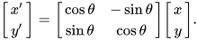]

--

Rotates on the plane given by the point; in the example above on the x-y plane, meaning around z

--

```glsl
    float val_cos = cos(u_time * .25);
    float val_sin = sin(u_time * .25);

    // Rotate around z
    ray_direction.xy = mat2(val_cos, val_sin, -val_sin, val_cos) * ray_direction.xy;
    // Rotate around y
    ray_direction.xz = mat2(val_cos, val_sin, -val_sin, val_cos) * ray_direction.xz;
```


---
.header[Further Effects | Repetition Example]

## Gamma Correction


???
.task[COMMENT:]  

* What is gamma correction?

---
.header[Further Effects | Repetition Example]

## Gamma Correction

Computer displays have a curious property: their color response is non-linear in respect to raw values passed from the graphics card. 

.footnote[[[tutsplus]](https://gamedevelopment.tutsplus.com/articles/gamma-correction-and-why-it-matters--gamedev-14466)]


???
.task[COMMENT:]  

* Nonlinear operation to encode and decode luminance in image systems
* Non-linear, in this sense, means that increases in one of your color components by a constant ratio (say, if a red component of a color becomes twice as high) will not result in an increase of the monitor-emitted light intensity by that same ratio (that means, the red light emitted from the screen will not be twice as high).
* Gamma encoding optimizes the usage of bits for the encoding of an image by taking advantage of the non-linear manner in which humans perceive luminance values.
* Human perception of brightness luminance follows an approximate power function
The human perception of brightness luminance follows an approximate power function, with greater sensitivity to relative differences between darker tones than between lighter tones (consistent with the Stevens power law for brightness perception).  
* If images are not gamma-encoded, they allocate too many bits or too much bandwidth to highlights that humans cannot differentiate, and too few bits or too little bandwidth to shadow values that humans are sensitive to and would require more bits/bandwidth to maintain the same visual quality

--

.left-even[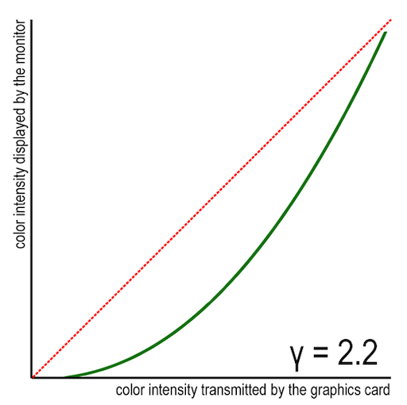]


???
.task[COMMENT:]  

* In a common scenario of gamma=2.2, this is how the monitor actually displays color intensities from your game (green curve). The dotted red line shows how a linear monitor would display the same intensities.


--
.right-even[
> Increases in one of your color components in the fragment shader by a constant ratio will not result in an increase of the monitor-emitted light intensity by that same ratio.
]

---
.header[Further Effects | Repetition Example]

## Gamma Correction

The color response of a display is an exponential function $x^\gamma$.

.footnote[[[tutsplus]](https://gamedevelopment.tutsplus.com/articles/gamma-correction-and-why-it-matters--gamedev-14466)]


???
.task[COMMENT:]  

* That is, the function EmittedLight(C), where C is a color component value (red, green, or blue) ranging from 0 (no light) to 1 (full light intensity), is C raised to some power γ. 

--

The function's exponent is called the *gamma exponent*. Typical gamma values range from 2.0 to 2.4, with $\gamma = 2.2$ as the compromise.


???
.task[COMMENT:]  

* a lot of newer monitors are designed to have the gamma value of precisely 2.2
* In practice, this means that black and white will be shown undistorted on the screen (because zero raised to any power is zero, and one raised to any power is one), but all values in between will be skewed with no reliable way to perceive this happening just by watching. 
* For example, if you're displaying a color that is supposedly two times darker than black—that is, RGB(0.5, 0.5, 0.5)—it will actually be shown as less than four times darker, given the common gamma value of 2.2, since 0.5 raised to 2.2 is around 0.22. Clearly, this is not what you intend, and this is not the case just with CRT monitors: LCDs, while not unintentionally having this property, are designed to be compatible with their older counterparts, and thus display your color values stretched like this.

---
.header[Further Effects | Repetition Example]

## Gamma Correction

Gamma correction is the act of undoing the monitor's scaling. 

--

> Gamma-correcting an image is essentially raising its color intensities to $\frac{1}{\gamma}$, so that when the monitor in turn raises the value to $\gamma$, these cancel out, and the result is the color we originally intended to be shown. 


???
.task[COMMENT:]  

* Remember that A raised to B, and then raised to C, is the same as A raised to B×C, and this is why these operations will cancel out, as gamma × (1/gamma) is 1.

---
.header[Further Effects | Repetition Example]

## Gamma Correction

.center[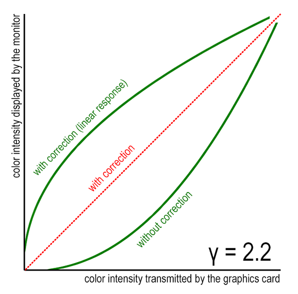]

.footnote[[[tutsplus]](https://gamedevelopment.tutsplus.com/articles/gamma-correction-and-why-it-matters--gamedev-14466)]


???
.task[COMMENT:]  

* Since the average user does not calibrate their monitor to have a linear response, many images they encounter are corrected so that they never feel the difference. As a convention, most image files on the Internet are distributed in what is called the sRGB color space—this means that original, intended color values are roughly raised to the power of 1/2.2 before putting them into files (although more complex equations take place in reality). This ensures that all users with conventional displays see the real colors. Scanners, cameras and a lot of digital imaging devices all take this into account, and correct their output for you when saving in conventional image formats.

---
.header[Further Effects | Repetition Example]

## Gamma Correction

Hence, a common implementation of Gamma correction is:

```glsl
// 1 / gamma = 1 / 2.2 = 0.4545

color = pow(color, vec3(.4545));
```

.footnote[[[tutsplus]](https://gamedevelopment.tutsplus.com/articles/gamma-correction-and-why-it-matters--gamedev-14466)]


???
.task[COMMENT:]  

## Example 2
* Compare to: https://www.youtube.com/watch?v=-adHIyjIYgk

---
template:inverse

# Aliasing and Anti-Aliasing


???
.task[COMMENT:]  

* What is aliasing?
* E.g. when graphics become smaller and smaller in the distance
    * Patterns get distorted
* In nature this problem arises as well because even human eyes have a limited resolution. Though nature does things well. When a pattern becomes so small that we can't see what it is made off, the colors of the pattern generally sort of elegantly blend with each other
* https://www.youtube.com/results?search_query=anti+aliasing

---
## Aliasing

.center[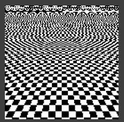  .imgref[[[bohemiantruckstop]](http://bohemiantruckstop.blogspot.com/2008/12/what-is-anti-aliasing.html)]]

???
.task[COMMENT:]  

* Aliasing artifacts can appear as wavy lines or bands, moiré patterns, popping, strobing, or as unwanted sparkling. In the sound domain they can appear as rough, dissonant, or spurious tones, or as noise.

---
## Aliasing

.center[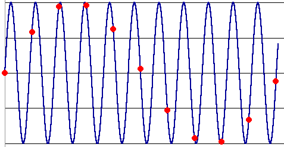 .imgref[[[matthews]](https://www.matthews.sites.wfu.edu/misc/DigPhotog/alias/)]]

???
.task[COMMENT:]  

* The red dots are what are recorded, since they represent the signal values at the times the signal is sampled. The pattern of the red dots is a terrible representation of the signal. The red sampled data looks like a sine wave at about one-tenth the frequency of the original! This is aliasing.

---
## Aliasing

.center[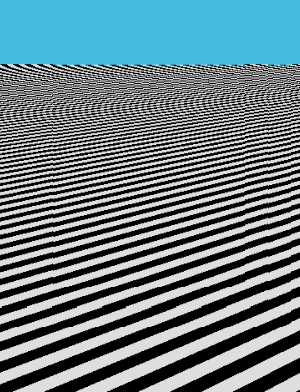 .imgref[[[scratchapixel]](https://www.scratchapixel.com/lessons/3d-basic-rendering/introduction-to-shading/procedural-texturing)]]


???
.task[COMMENT:]  

* With regular stripes this often gives an effort called the moire pattern which you can see an example of in the image on the right. 
* opaque ruled pattern with transparent gaps is overlaid on another similar pattern. For the moiré interference pattern to appear, the two patterns must not be completely identical, but rather displaced, rotated, or have slightly different pitch. 

---
## Aliasing

.center[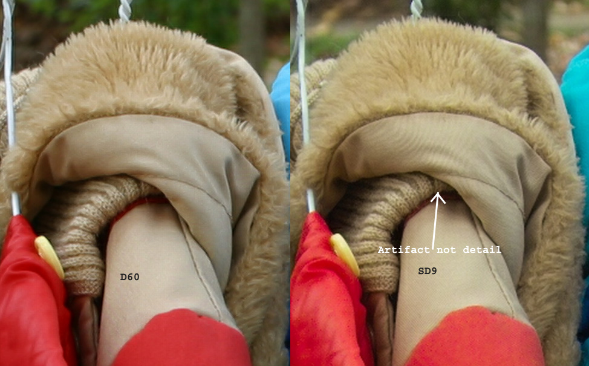 .imgref[[[matthews]](https://www.matthews.sites.wfu.edu/misc/DigPhotog/alias/)]]


???
.task[COMMENT:]  

* Aliasing is rarely seen with digital cameras, because digital cameras almost always use intentional blurring in front of the CCD to avoid aliasing. In most such cameras the filter is permanently installed, but some high-end cameras have a removable anti-aliasing filter just in front of the CCD. Many camera makers just design the blurring into the lens. (Those digitizing audio for CD's pass the music through a low pass filter before digitizing to accomplish a similar purpose.)
* The absence of an antialiasing filter can cause dramatic Moire patterns even in real-world images. Below are comparison images by Dave Etchells of Imaging Resource using the Canon D60 (with an antialias filter) and the Sigma SD-9 (which contains no antialias filter). The bands below the fur in the image below at right are the kinds of artifacts that appear in images when no antialias filter is used. Sigma chose to eliminate the filter to get more sharpness, but the resulting apparent detail may or may not reflect features in the image.
* These kinds of artifacts are impossible to remove after the fact, as they are indistinguishable from what could be real image detail. This is why there can never be an effective software antialias filter.
* https://www.matthews.sites.wfu.edu/misc/DigPhotog/alias/

---
## Anti-Aliasing


???
.task[COMMENT:]  

* Does what exactly?

--

Anti-aliasing removes signal components that have a higher frequency than the sampling can resolve.


???
.task[COMMENT:]  

* or can be resolved by the recording device
* In signal acquisition and audio, anti-aliasing is often done using an analog anti-aliasing filter to remove the out-of-band component of the input signal prior to sampling with an analog-to-digital converter. In digital photography, optical anti-aliasing filters are made of birefringent materials, and smooth the signal in the spatial optical domain. The anti-aliasing filter essentially blurs the image slightly in order to reduce resolution to below the limit of the digital sensor (the larger the pixel pitch, the lower the achievable resolution at the sensor level (http://bohemiantruckstop.blogspot.com/2008/12/what-is-anti-aliasing.html)


--

.center[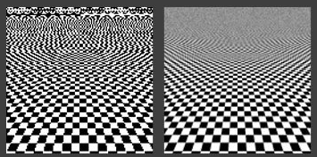 .imgref[[[bohemiantruckstop]](http://bohemiantruckstop.blogspot.com/2008/12/what-is-anti-aliasing.html)]]

---
## Anti-Aliasing

.center[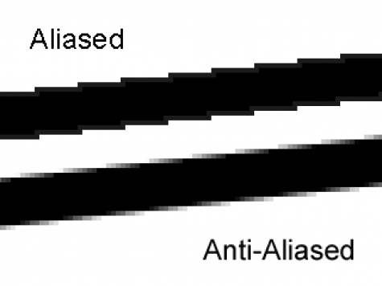 .imgref[[[dhanalakshmisps]](https://dhanalakshmisps.blogspot.com/2016/08/aliasing-aliasing-is-g-eneration-of.html)]]

---
## Anti-Aliasing

There are various types of Anti-Aliasing algorithms

* Super Sampling Anti-Aliasing (SSAA)
* Multi-Sampling Anti-Aliasing (MSAA)
* Fast Approximate Anti-Aliasing (FXAA)
* Morphological Anti-Aliasing (MLAA)
* Enhanced Quality Anti-Aliasing (EQAA)
* Coverage Sample Anti-Aliasing (CSAA)
* Temporal Anti-Aliasing (TXAA)
* ...?


???
.task[COMMENT:]  

* Multi-Sampling Anti-Aliasing (MSAA): It is one of the very primitive kind of Anti-Aliasing invented back the eras of Direct X 8, still it is being used in every modern game as an open platform for both NVIDIA and AMD. It causes the performance to drop very frequently with an increase in MSAA quantity, for example 2MSAA < 4MSAA < 8MSAA visual quality achieved with higher MSAA is better, but it costs very much performance, probably will eat plenty of fps rendered by GPU. MSAA does not uses blur filters like TXAA so 8MSAA gives a decent result, but performance cost is much more than Temporal AA or TXAA.
* Fast Approximate Anti-Aliasing or FXAA is a Nvidia engineered Anti-Aliasing that works in a greatly straightforward style. The  algorithm hunt down all edges in the picture, then smears them to make edges in image anti-aliased. It uses very slight blur filter also have negligible impact on your gaming performance, simply it will cost you 1-2 frames per second (fps). This type of AA is preferred if you can sacrifice slight image quality, off-course it is better than no AA. FXAA is the best Anti-Aliasing tech for those having mid end rig
* Temporal AA or TXAA is again, NVIDIA proprietary tech. It uses lesser blur filters which make the image slightly blur, but the performance is amazing with loosing just few fps. 2 x TXAA impacts lower on performance of games and work much better than 2x Multi-Sample Anti-Aliasing (MSAA). Interesting chunk is that TXAA was first used by AMD in very old gen. Cards then abandoned it for poor performance, afterwards NVIDIA improved it and made it exclusive. In many NVIDIA partnered games uses TXAA exclusively for NVIDIA GPUs to lose lesser performance and gain higher AA image quality.
* Morphological AA or MLAA is AMD’s exclusive Anti-Alias technique, it cost the same performance as 2MSAA but the performance is not that much better. It does not use much blur filters like FXAA but FXAA costs lesser fps and works much better.
* Enhanced Quality Anti-Aliasing or EQAA works extremely well, it adds extra coverage samples to Multi-Sampling AA and thus increasing AA quality of aliased image very well. It’s an AMD’s exclusive tech, but only supported by HD 6900 series and above.
Coverage Sample Anti-Aliasing (CSAA):
* Coverage sample Anti-Aliasing is CSAA used in many NVIDIA partnered games like Assassin’s Creed IV Black Flag and Batman etc. as it’s Nvidia’s exclusive. It works on a similar principle as EQAA do by adding coverage samples to MSAA. Unlike AMD’s EQAA it works on all NVIDIA DX 11 GPUs and DX 10 GPUs since Geforce 8000 series.
* SSAA or Super Sampling Anti-Aliasing is a brutal type of AA which eats your fps by a large quantity. The performance of SSAA is mind blowing with no blur and even sharper textures as its upscale image than downscale according to your Resolution, the sharper looking textures and no aliased edges is the result you will get by using SSAA but unless you have a beasty rig you will not tend to use it. In games like Metro Last Light you can check out how much performance does the SSAA reduces but indeed the quality attained is wow.
* (https://ageeky.com/role-of-anti-aliasing-aa-in-gaming/)

--

Appropriate algorithms can also be found as *filtering* and *band-limiting* techniques.

---
## Anti-Aliasing

How much anti-aliasing you need, depends on the scene:


.center[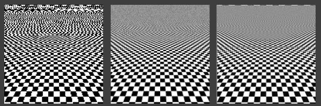 .imgref[[[bohemiantruckstop]](http://bohemiantruckstop.blogspot.com/2008/12/what-is-anti-aliasing.html)]]


???
.task[COMMENT:]  

* Not averaged but with a sync filter
* Aliasing is very well studied and pretty well understood. It finds its root in signal processing theory which is a very large (and reasonably complex) field of science. Solving aliasing though is a complex problems for which we don't have the perfect miracle solution


---
.header[Anti-Aliasing]

## Super Sampling

* Sample at a greater resolution than the final data resolution
* Combine sampled values (down-sample) to the desired resolution often by a simple average
  
--
  
This technique has tremendous computational cost!
  
--
  
But is super easy 😁

---
## Anti-Aliasing

```glsl
void main()
{
    vec3 color = render(gl_FragCoord.xy);

    #ifdef USE_ANTIALIASING
    color +=
        render(gl_FragCoord.xy+vec2(.5,.0))+
        render(gl_FragCoord.xy+vec2(.0,.5))+
        render(gl_FragCoord.xy+vec2(.5,.5));
    color /= 4.;    
    #endif

    gl_FragColor = vec4(color, 1.0);
}
```


???
.task[COMMENT:]  

* https://www.shadertoy.com/view/wl3Sz2
* https://www.shadertoy.com/view/Xds3zN
* https://en.wikipedia.org/wiki/Supersampling

Show CSG example with aa

--

A bit more elegantly and controllable: [Raymarching - Primitives](https://www.shadertoy.com/view/Xds3zN)

---
## More Examples

.center[<video autoplay loop width="580"><source src="./img/preview_05.webm"type="video/webm"></video>]

---
template:inverse

# Final Words of Advice


---
.header[Final Words of Advice]

## Optimization

We are reaching our GPU's limits.   

***It is time to care about how to make the algorithms faster!***
  
--
  
<br >
E.g., [GLSL Optimizations](https://www.khronos.org/opengl/wiki/GLSL_Optimizations)


???
.task[COMMENT:]  

## Code Verbosity

The number of characters in the fragment shader code length does matter!
* I don't know how much though...


* That is why e.g. examples on Shadertoy are notoriously difficult to read
* The lecture code is intended to be descriptive
* Code can be shortened quite heavily


This means e.g.

* Short variable names
* Merge variable definitions
    * float var1 = 0, var2 = 2, var3 = 3;


---
.header[Final Words of Advice]

## GLSL Versions

OpenGL and GLSL are constantly evolving. It is crucial to be clear about the version you are using. The version also depends on the environment.

--

Try to use a GLSL version > 3.3.

```
#version 330 
```


???
.task[COMMENT:]  

* The following must be the first line to set the version
* The latest version is 4.6, I believe

OpenGL
* OpenGL shaders are written in the OpenGL Shading Language (GLSL), which has a syntax based on the C programming language.
* For example OpenGL 3.2 added a new type of shader: geometry shaders, and version 4.0 added tessellation control and tessellation evaluation shaders.
* For professional programs the first line in a GLSL shader indicates a version tag

WebGL
* WebGL (Web Graphics Library) is a JavaScript API for GPU rendering.
* WebGL programs consist of control code written in JavaScript and shader code that is written in OpenGL ES Shading Language (ESSL).
* OpenGL ES (Embedded Systems) is a cut down version of the full OpenGL specification aimed at mobile devices.
* WebGL (Web Graphics Library) is a JavaScript API for GPU rendering.
* WebGL programs consist of control code written in JavaScript and shader code that is written in OpenGL ES Shading Language (ESSL).
* OpenGL ES (Embedded Systems) is a cut down version of the full OpenGL specification aimed at mobile devices.


---
template:inverse

## Your Turn!
# 👩🏽‍💻


???
.task[COMMENT:]  

* Go through the code examples one more time, make sure to understand them and experiment without any design goal, collect questions
* Then try to create one "good looking" or creative example


---
template: inverse

## The End

# 🤓
